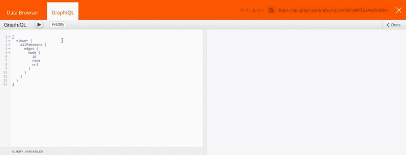
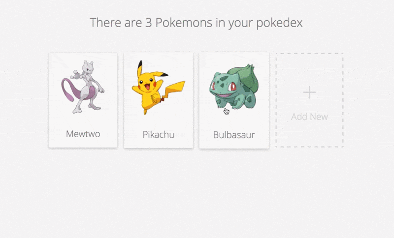

# Learn Relay with Pokemons

> Learn Relay offers a new, interactive learning experience for Relay

Getting started with [Relay](https://facebook.github.io/relay/), the GraphQL
client, is pretty difficult based purely on its reference documentation, which
is fairly technical and server centric. We set out to create an interactive
learning experience, to give developers an easy start with Relay.

Today we're announcing [Learn Relay](https://learnrelay.org/), a comprehensive
yet **easy and fun** introduction to Relay. All concepts are introduced **step-by-step** helping you to not feel overwhelmed while getting started.

## Focus on the frontend

One of the biggest problems faced when getting started with Relay is that you
need to build your own Relay-compatible GraphQL backend first. To avoid this
we've included a pre-configured GraphQL backend endpoint which works out of the
box. The backend can be accessed via GraphiQL or an integrated data browser.
This way you can focus on learning Relay (in the frontend).

After authenticating via Github you'll get a pre-configured GraphQL endpoint

## Build a Pokedex with Learn Relay

There is no better way to learn a new technology than using it to build
something. That's why a provided example forms a core part of Learn Relay. By
following the guide, you will build a Pokedex app from start to finish.

[A live demo of the Pokedex is available here](http://demo.learnrelay.org/)!
(Note: We disabled mutations to prevent a global mess.)

We're providing the UI of the Pokedex app, so you can focus on learning the
concepts of Relay

## Learn Relay is open source

The source of [Learn Relay](https://github.com/learnrelay/learnrelay) and the
[Pokedex](https://github.com/learnrelay/pokedex) example is available [on Github](https://github.com/learnrelay). One of the reasons we ❤️ open source is all the amazing contributors. We couldn't have done Learn Relay on our own so a
big special thanks to: [Varayut Lerdkanlayanawat](https://github.com/lvarayut),
[Julian Tapales](https://github.com/JulianTapales), [Constantijn
Schepens](https://github.com/ram535ii), [Joseph
Savona](https://github.com/josephsavona), [Rene Brandel](http://brene/) and
[Julian Bauer](https://github.com/julianbauer).

We hope this guide helps you to get started with Relay. We highly recommend
using it for your next application. If you have questions about Learn Relay or
need help to get started, let's chat on [Slack](http://slack.graph.cool/). 🙌
