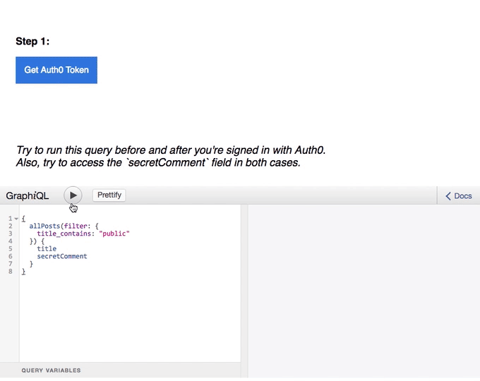
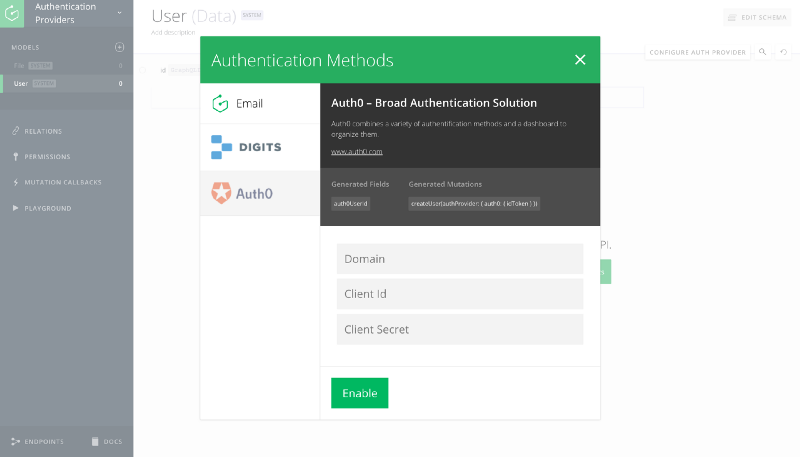

# User authentication in GraphQL with Auth0 & Digits

Authenticating users is an integral part of most applications with the goal to
make it as easy as possible for users to sign-in whilst still enforcing
security. Implementing this process manually, including external authentication
providers, can be very challenging as well as seriously time consuming.

## Graphcool now works out-of-the-box with Auth0 and Digits

Our goal is to make this process as seamless as possible, so today we're
announcing support for **two new Auth Providers: [Auth0](https://auth0.com/)
and [Digits](https://get.digits.com/)**.

Auth0 is a great user management & authentication service providing features
such as Social Login, SSO and identity management for web & mobile apps. Digits
allows users to sign-in using their phone numbers.

An *Auth Provider* is a way for users to authenticate (sign-up/log-in) with your
application using the `createUser` or `signinUser` mutation. These mutations will be automatically
generated based on which provider you have enabled and return a user session
token. This token needs to be sent as HTTP header for subsequent requests to
authenticate the user. ([Read more.](!alias-seimeish6e#authentiation-providers))

> Works out-of-the-box with Auth0 Lock. An example can be found [here](https://github.com/graphcool-examples/react-lokka-auth0-example).

Besides Auth0 and Digits, we're also supporting the *Email Auth Provider*(email-password-based authentication) as part of the Graphcool platform and will continue to extend its functionality.

## Enabling an Auth Provider in your project

It's easy to enable Auth Providers in your existing projects. All you need to do
is to configure the required credentials (e.g. from your Auth0 or Digits account).

> Auth providers can be easily configured in your Graphcool project

Our carefully designed API lends you flexibility throughout the application
design process. You can combine multiple Auth Providers depending on your use
case. In all cases, your API will behave consistently (meaning
enabling/disabling Auth Providers won't affect others).

## Tutorial: User authentication with Auth0 for React & Apollo

The easiest way to get started is by watching the following video tutorial.

<iframe height="315" src="https://www.youtube.com/embed/5uxq8Om-AZQ" frameborder="0" allowfullscreen></iframe>

## Further resources

We also prepared a [hosted demo for Auth0 and Lokka](https://graphcool-auth0.netlify.com/). The code for all our examples is available in our [examples repository](http://github.com/graphcool-examples) on Github. We are already
working on Auth Provider guides for other technologies like Angular 2 and Relay,
so stay tuned!

Do you have questions about Auth Providers or user authentication in GraphQL?
Join our [Slack channel](http://slack.graph.cool/), we'd love
to talk! If you haven't done so already, setup your own GraphQL backend in less
than 5 minutes on [Graphcool](https://graph.cool/).
