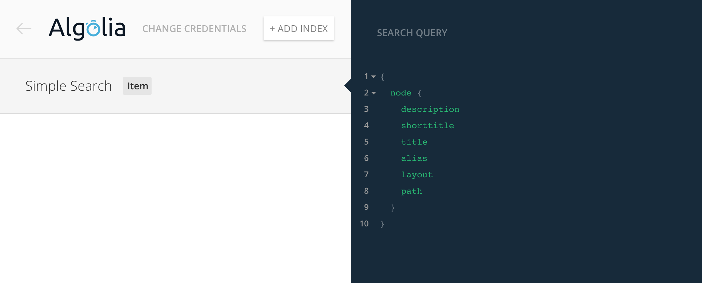
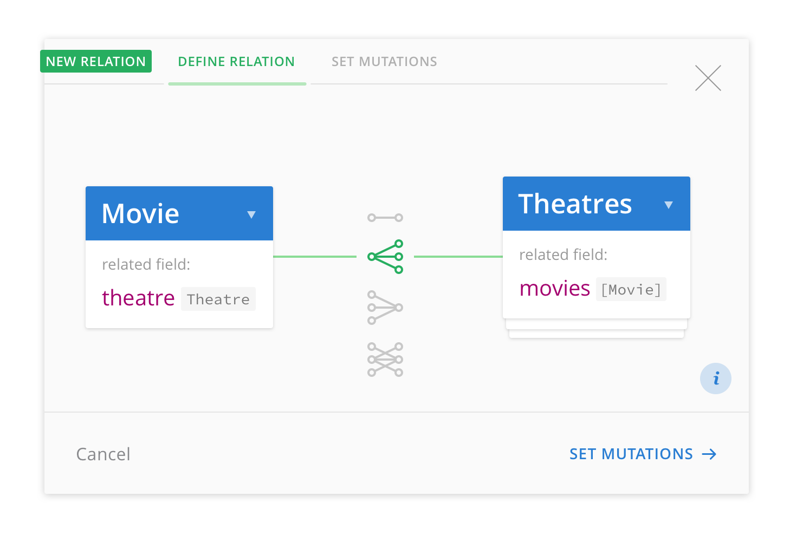

# Announcing Integrations, Team Collaboration and Pricing Updates

> TL;DR: Graphcool has integrations for many services including Algolia, Auth0 & Digits and it's now possible to invite project collaborators. We're also updating our pricing model to be more transparent and fair.

Over the last few weeks we received great feedback from thousands of developers building amazing apps on Graphcool. **Today we're excited to announce a whole range of new features and improvements**. We're also announcing an update to our pricing model to make it easier to understand and fair to use.

## More Integrations

Our vision is to make software development truly modular and as simple as playing Lego. We heavily rely on the concept of combining existing services to build great applications. So far, Graphcool already supports [Auth0 and Digits](!alias-thoh9chaek) for user authentication.

Today we're releasing a new integration for the popular search service [Algolia](https://www.algolia.com). This new integration allows you to automatically sync your model nodes to Algolia indices. So every time your data changes it will be automatically updated in your Algolia index as well.

You can create multiple indices and select exactly the data you want to be synced using the familiar GraphQL query syntax. We've prepared [this live demo](!alias-aroozee9zu) that gives you an easy start with Algolia and GraphQL.

## Team Collaboration

One of the [most requested features](https://github.com/graphcool/feature-requests/issues/19) we received from our community was the ability to add team collaborators to a project. This is now possible in the new "Team" tab in your project settings. Here you can invite your colleagues by entering their email address.

Note: Every collaborator currently has the same access rights. However, there is already a [feature request](https://github.com/graphcool/feature-requests/issues/94) to define different access control levels for collaborators.

## Console Improvements

Creating fields and relations between models is one of the most important workflows using the Console. We've completely redesigned these processes to make it even easier and more intuitive.

> We're constantly improving our Console which is [open source](https://github.com/graphcool/console) by the way. If you ever experience a problem, feel free to create an issue on Github.

## Pricing

We believe that the best GraphQL backend should be available to everybody, so building production level application on Graphcool is now price-competitive with traditional hosting. In addition to this we have introduced a $9/month plan that should get you a long way when you grow out of the free developer plan.

Our intention behind the new pricing structure is to be transparent and fair to as many kinds of apps as possible. Graphcool projects are billed based on database storage and number of requests per month. You should be able to estimate your cost even before signing up and different apps have different requirements.

So to reiterate - with Graphcool you can start building for free and host a real app with thousands of users for just $9. This means that you don't have to be scared from scaling up and can stay focused on improving your product instead.

If you are interested in an on-premise solution or more dedicated support as you are starting to introduce GraphQL in your organisation we are happy to set up a call to discuss our Enterprise offering.

## Become a Beta Tester

We have some exciting new features in the pipeline and would love to get your feedback. By participating in our beta program you will be able to shape the future of Graphcool and ensure new features cover all your needs from the beginning.

Currently the beta program contains two major features. Subscriptions with full filter support enable your apps to be updated with data changes in realtime. Permission Queries make it easy to add even complex permission rules to your projects. While we already received great feedback, we're still searching for beta testers. Just drop us a message in [Slack](http://slack.graph.cool) or talk to us right from the Console.

We are also working on support for new datacenter regions in US and Asia. Stay tuned for more information.
