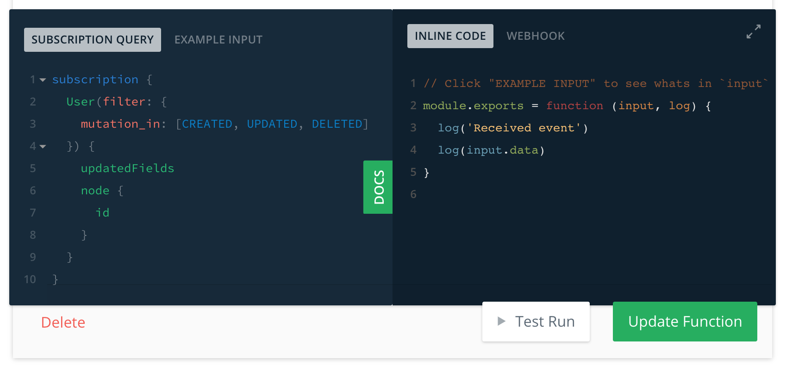
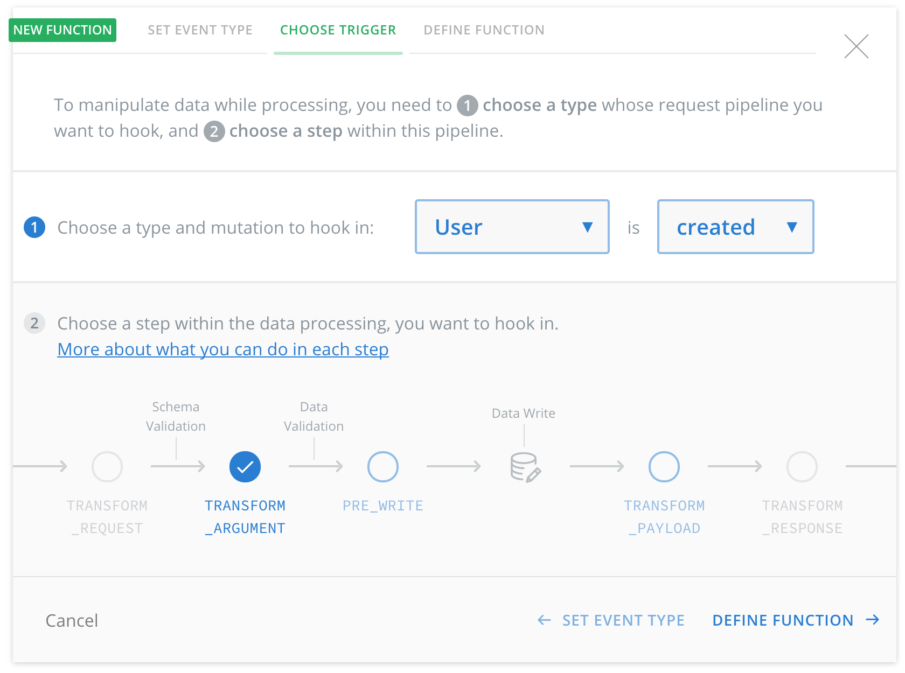

# Introducing Functions & Graphcool CLI

Today we are announcing two new major additions to the Graphcool platform: Functions & the Graphcool CLI.

The CLI enables a completely new development workflow making it easier and quicker than ever to work with Graphcool. Using functions you can extend your GraphQL API to implement any kind of business logic without the need to run your own servers.

## A better development workflow using the CLI

While the Console is a great way to get started with Graphcool, you need more advanced tools to manage your projects as they evolve and grow in complexity.

We received a lot feedback from our developer community about this. These were the most common use cases:

* How to keep your schema in version control?
* How to perform multiple changes in a single migration?
* How to deploy the same schema to separate environments for staging and production?

### Introducing `graphcool`

These and many other use cases are now possible using the Graphcool CLI. Additionally to your Graphcool Console, you can now edit your schema through a local project file (usually called `project.graphcool`) and push the changes using the CLI. Here is how it looks like:


### Getting started with the CLI

It's easy to get started by installing the CLI via NPM (or [Yarn](https://yarnpkg.com/)). After an initial authentication, you can list all of your projects like this:

```sh
# Install the CLI
npm install -g graphcool

# Show all projects
graphcool projects
```

Creating a new project is now as easy as running `graphcool init`. This automatically creates a your local `project.graphcool` file containing the [GraphQL SDL](!alias-kr84dktnp0) schema for your data model. Simply edit this file in your editor to change your schema. You can apply your local changes to your project by running `graphcool push.

Check out the following tutorial to see how to get started using the Graphcool CLI or check out the [CLI documentation](!alias-kie1quohli).

<iframe height="315" src="https://www.youtube.com/embed/sf0ZkyalSTg" frameborder="0" allowfullscreen></iframe>

The CLI is open source and [available on Github](https://github.com/graphcool/graphcool-cli). Please open an issue if you have any feedback or want to request a feature. We're planning to reach feature parity between the Console and the CLI going forward.

## Implementing business logic with functions

The second big feature we're introducing today are **Functions**.

Functions are basically small building blocks and provide a way to perform some kind of logic. There are two types of functions: Inline functions and webhooks (as previously used in "Mutation Callbacks").

### Inline functions: Develop directly in your Console

We have partnered with [Auth0 Extend](https://auth0.com/extend/?utm_source=graphcool&utm_medium=gp&utm_campaign=extend_site) to enable you to write your functions directly in the Graphcool Console. Inline functions can be created in seconds and the integrated testing workflow and execution logs make it easy to implement and debug new business logic.



A function is always provided with an *event* as payload (or function argument) and invoked because of a *trigger*. Currently there are two types of event triggers: Server-side Subscriptions and Request Pipeline.

### Server-side Subscriptions: The new "Mutation Callbacks"

The current mutation callback API has been with us from the very beginning, enabling you to implement business logic such as sending a welcome mail to new users or charging a credit card when an order is placed. We have received many suggestions on how we could improve it, and when we implemented the GraphQL Subscriptions API late last year we planned ahead by incorporating this feedback for the API design.

Today we are changing the API for mutation callbacks to align with GraphQL subscriptions and rebrand the feature to Server-side Subscriptions. Server-side Subscriptions are an easy way trigger a function and benefit from powerful features like filtering familiar from the Subscription API.

Checkout the following video to see Server-side Subscriptions in action or read more about it in the [documentation](!alias-ahlohd8ohn).

<iframe height="315" src="https://www.youtube.com/embed/l-0jGOxXKGY" frameborder="0" allowfullscreen></iframe>

### Request Pipeline: Implementing data validation and transformation

One of the most requested features was the ability to add data validation for specific fields. The Request Pipeline is a powerful programming model that allows you to do that and much more.

With the request pipeline you can for example:

* Validate the format of a shipping address
* Sanitise and normalise user input
* Retrieve extra information from an external system

The request pipeline allows you to write functions that hook into the processing of a mutation at 3 different stages.



* Hook into `TRANSFORM_ARGUMENT` to perform data validation or transform data before it is stored in the database
* Hook into `PRE_WRITE` to call external systems after data validation, but before data is stored in the database
* Hook into `TRANSFORM_PAYLOAD` if you need to transform the data that is returned from a mutation, but not what is stored in the database.

To get started with the Request Pipeline, check out the [documentation](!alias-pa6guruhaf) or read our latest blog post about [introducing the Serverless GraphQL Backend Architecture](!alias-ahde7paig2) to learn more about the involved concepts and the bigger picture.

### Bonus-feature: HTTP Headers for webhooks

Last but not least, a tiny, but strongly requested feature is to configure HTTP headers for webhooks. This feature enables you to secure your webhooks by including an Authorization header or connect directly to external systems that require special headers.

## Enjoy building

We're very excited about these two new features, as they enable a better development workflow and provide a lot of flexibility when building applications with Graphcool. Thank you for all of your feedback and support! 💚
