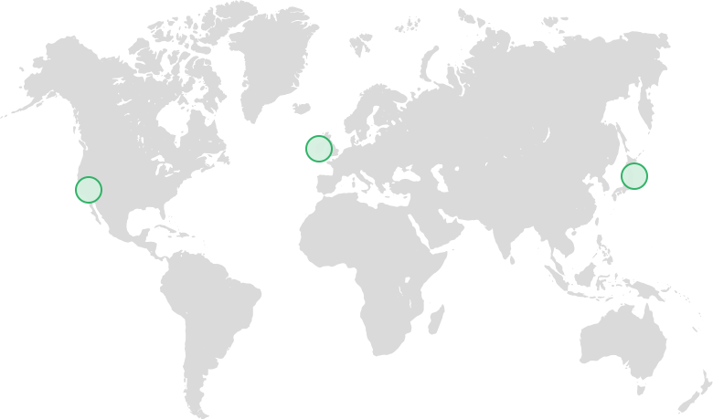
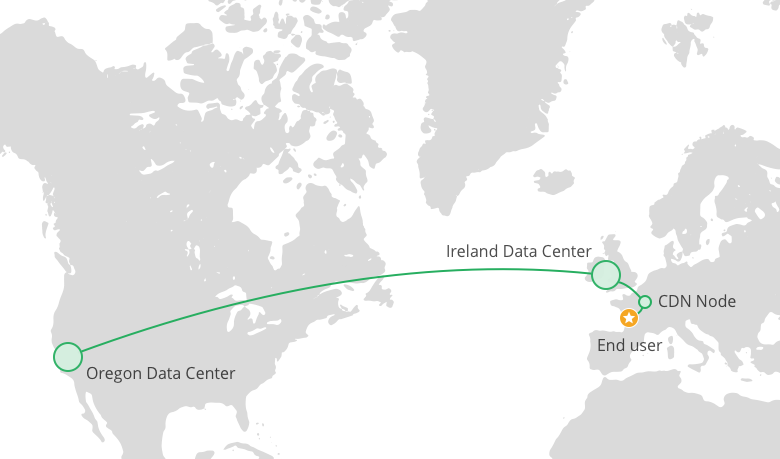

# New Regions and Improved Performance

At Graphcool, we continuously invest in new features such as our [powerful permission system](!alias-oolooch8oh/) or the integration of [serverless functions](!alias-teko4ab8za/#implementing-business-logic-with-functions). However, we're also committed to making sure that we are delivering the best possible performance for our customers!

We have a lot of performance improvements planned for the next couple of months. Today, we are happy to announce two recent changes to our infrastructure that will be a first step in that direction and significantly improve the response times for your apps:

1. Selection of data regions
2. Improved API performance

## Regions

One of the most requested features from our customers was the ability to have control over the [region](https://aws.amazon.com/about-aws/global-infrastructure/) where their application data is stored. Until recently, all data of Graphcool projects was stored in the _EU (Ireland)_ region.

Due to high demand, we now added two more regions that customers can choose from: _US West (Oregon)_ and _Asia Pacific (Tokyo)_. We've rolled out this feature over the last few months for some of our beta testers and are finally making it available for everybody today!



> Creating your Graphcool project in a region close to your customers can dramatically increase performance of your app.

### How does it work?

When creating a new project in the [Graphcool Console](https://console.graph.cool/), you can now choose in which *region* the data should be stored. We also provide a recommendation as to which one might be the fastest for you. This is based on response times of a request from your machine to the corresponding datacenter:


If you use the [Graphcool CLI](!alias-kie1quohli/), you can add the `--region` flag when creating a new project:

```sh
graphcool init --region us-west-2
```

### Compliance with government regulations

For applications that contain personally identifiable information or data that is otherwise regulated, you might be required by law to keep your data within a given geographic region. With our three dedicated regions, many companies will be able to operate in compliance with local regulations on our [standard hosted plans](https://www.graph.cool/pricing).

For dedicated installations or support for specific geographic regions please [get in touch with our sales team](mailto:sales@graph.cool).

### Global GraphQL Data Delivery Network

With today's addition of two new regions, we are laying the foundation for a Global GraphQL Data Delivery Network.

When you create a project and select one of the three Graphcool regions, all data for that project will be fully stored inside that region. We call this a project's *primary region*. All queries and mutations will be served by a project's primary region, even if there is a region closer to the user.

In the future you will be able to transparently sync data from the primary region to other regions in order to deliver fast local query results to users in all regions of the world.

## Infrastructure Deep Dive

Let's take a closer look at how all of this works.

### Global Routing

The Graphcool global network has 3 layers:

* Backbone connecting each region
* Optimized CDN terminating close to the user
* Public internet

When talking about global network routing, it is important to realise that the public internet is relatively slow and has a high variance in latency. The first step towards providing low and predictable latency is to route the request to our infrastructure as soon as possible.

Let's consider an example. If the primary region for your project is *US West*, a user located in France might be routed as depicted in this image:



Graphcool operates an optimised CDN with more than 50 nodes all over the world. In our example above, the request is routed to the closest CDN node in Paris.

> The CDN provides the following benefits:
>
> - **Keep-Alive connections:** All CDN nodes keep open connections to the datacenter of the nearest Graphcool region. This reduces overhead on the TCP level for the first request issued by a user.
>
> - **SSL Optimizations:** All requests to the Graphcool API are served on secure connections. The SSL protocol is based on a handshake to exchange keys before the actual request can be sent. When a user first connects, this introduces a full extra roundtrip, potentially doubling the latency of the first request. By terminating SSL on the CDN node close to the user, we can reduce this overhead by an order of magnitude.


From the local CDN node the request is routed on dedicated infrastructure to the nearest Graphcool region, which is *EU* in our example case. Since this is not the primary region that's specified in the project, the request is then forwarded again to the actual primary region *US West*.

## Looking Inside a Graphcool Region

When a request arrives at a Graphcool region, the real work begins. Each region consists of two fully redundant availability zones. The following diagram displays the main components of a single availability zone:


The first step is a scalable and fault tolerant load balancer that routes an incoming request to the correct subset of servers.

We rely heavily on Docker to deploy and scale individual services. As you can see in the diagram we operate two individual clusters.

* The **Meta Cluster** manages your GraphQL schema and ensures all changes are applied correctly to your API and project database.
* The **Project Cluster** serves all live traffic for your Graphcool project. We have individual deployment groups for each API and use auto-scaling to ensure we always have enough capacity to handle the load on each API.

If you have previously created your own GraphQL server with a framework like [graphql-js](https://github.com/graphql/graphql-js) or [Sangria](https://github.com/sangria-graphql/sangria), you know that you have to define the capabilities of your API upfront in the form of a *GraphQL schema*. In effect, that schema is defined at compile-time and instantiated once when the server boots up. With Graphcool, the situation is a bit different since we support schema migrations to *live projects*. We thus needed to implement a more sophisticated system.

API servers in the Project Cluster coordinate with the Schema API to make sure they always expose the most recent version of the GraphQL schema. By optimising this coordination process, we were able to reduce the baseline latency to one third of what it was before. Read on for details!

## Improved API Performance

Moving your project closer to your customers can provide significant performance benefits to your application. But to get even better performance, we need to ensure that the Graphcool API servers also return a response as quickly as possible!

### What we changed

On June 17, we started rolling out a new approach to *schema caching* that significantly reduced the latency of all requests to the API servers.

The source of truth for a project's structure is the replicated database cluster in the Meta Cluster. When you perform a schema migration for one of your projects with the Graphcool CLI (or Console), you are enqueuing a series of complex operations that will eventually be persisted to the Meta Database Cluster. Once that process is done and the changes are fully persisted, a schema invalidation message is sent to the Project Cluster.

In our old architecture, we kept a JSON serialized version of the schema cached in a Redis cluster inside the Project Cluster. Whenever the schema in a project was updated, a lambda function would populate the Redis cache with the new version. On each request to the Simple and Relay APIs, the API server would have to load the schema from Redis and instantiate a GraphQL server for the schema before processing of the request could begin.

In the new architecture, we are moving the schema cache into the API servers themselves. This reduces network overhead and enables us to keep the GraphQL server warm between requests.

### Average response times are 80ms faster

A graph of *50-percentile server side latency* gives a good indication of what kind of latency we should expect from simple queries, such as retrieving a single node or querying the first 10 nodes in a relation. The graph shows how this latency went down after we flipped the switch and enabled the infrastructure improvements at 6 PM, June 17.


As you can see our baseline dropped from 60 ms to 20 ms. We are also seeing more stable performance for projects with high load.

The following graph shows the *average response time* across all queries on Graphcool. This is more representative of what you should expect from a complex query with filters returning data from multiple relations.


As you can see, the average performance for these complex queries varies over time. The June 17 release reduced average response time from 180ms to 100ms.

### More improvements to come

Over the next half year we will introduce more tools that help you analyse and tune performance of your queries. At the same time we are continuously working to make sure Graphcool delivers the best possible baseline performance. Stay tuned!
