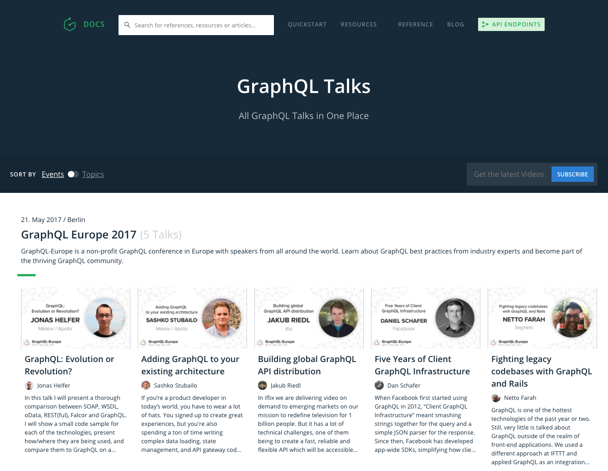

# Find & Watch the Best GraphQL Talks

With more and more awesome GraphQL talks given at conferences and Meetups, it’s hard to stay on-top and discover the most interesting content. Today, we're launchig GraphQL Talks, a new resource that'll help you find the best talks all around GraphQL.

## Lots of Awesome Talks to Watch

There already are a lot of Meetups all over the world that are purely dedicated to GraphQL, many of which record the talks that are being given and publish them afterwards. 

The same goes for actual conferences, [GraphQL Summit](https://summit.graphql.com) in San Francisco had 350 attendees last year and will be much bigger in its upcoming version in October. [GraphQL Europe](https://graphql-europe.org), the first GraphQL-only conference in Europe, accomodated more than 300 developers earlier this year and is likely to also grow substantially in its next edition.  

It's currently not easy to discover the talks that are given at all these different events, that's why we built GraphQL Talks!

## Announcing "GraphQL Talks"

Starting today, you'll be able to find a collection of all the GraphQL Talks that were given at conferences and Meetups on the Graphcool website: [https://www.graph.cool/talks/](https://www.graph.cool/talks/)

We improve the discoverability of awesome content for you by letting you filter the available talks by **Events** or **Topics** (such as _Best Practices_, _Case Studies_, _GraphQL Clients_ and many more).

## Bonus: GraphQL Europe Videos 🇪🇺

As a bonus, we're including some of the talks that were given at GraphQL Europe earlier this year for the launch of this new resource.

Right now there are already 5 videos available, among them [Dan Schafer](https://www.youtube.com/watch?v=5lcvRd80jYk) sharing interesting learnings and great insights from five years of using GraphQL at Facebook.

## Stay Tuned

The best thing is, you don't have check the site - we'll let you know when there are new videos available. All you have to do is put in your email address and we inform you about all the new videos that are added to the page.

<!-- TALKS_SIGNUP -->

If you are a Meetup or conference organizer and want to see your recordings on GraphQL Talks as well, [let us know](mailto:hello@graph.cool).

