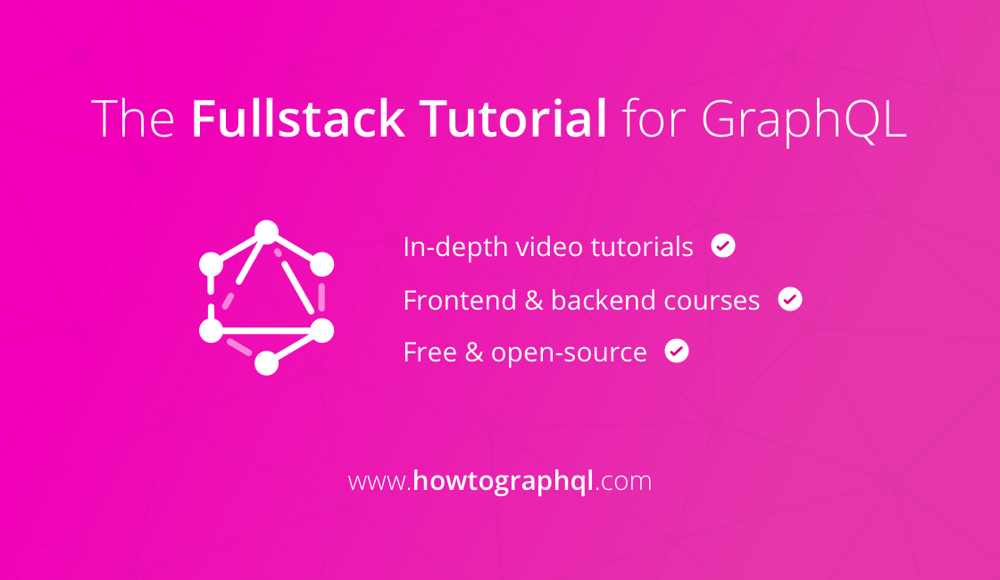

# How to GraphQL - The Fullstack GraphQL Tutorial

GraphQL is a revolutionary way to expose data from APIs - yet many developers have difficulties to understand where it fits into their technology stack. We are very excited to launch a new, holistic tutorial website that teaches you how to use GraphQL on the frontend and the backend, using all major programming languages and frameworks. All content is completely free and open-source!

## Hard to find the "right" Tutorial

Our whole team at Graphcool is full of GraphQL enthusiasts - we love GraphQL and we want everyone to be able to participate in using this fantastic API technology. 

However, as GraphQL can be used with _any_ server-side programming language developers often have a hard time to find just the "right" tutorial. Additionally, the tutorial space for GraphQL is very fragmented which makes it even more difficult to find the right content that fits a specific use case and technology stack.

**How To GraphQL** provides a holistic approach to learning GraphQL. There are three major parts:

1. GraphQL (Fundamentals & Advanced)
2. Frontend (Hands-on Tutorials) 
3. Backend (Hands-on Tutorials) 

## For the Community, by the Community 

How to GraphQL was created with the help of many amazing developers who did a great job in creating the content for the different tutorial tracks.

Special thanks to the contributors of all initial tutorials that are available at the launch:
- [Maira Bello](https://github.com/mairatma): Contributed the [graphql-js](https://www.howtographql.com/graphql-js/0-introduction/) tutorial
- [Radoslav Stankov](https://twitter.com/rstankov): Contributed the [graphql-ruby](https://www.howtographql.com/graphql-ruby/0-introduction/) tutorial
- [Bojan Tomic](https://twitter.com/kaqqao): Contributed [graphql-java](https://www.howtographql.com/graphql-java/0-introduction/) tutorial
- [Ben Wilson](https://twitter.com/benwilson512) & [Bruce Williams](https://twitter.com/wbruce): Contributed the [Absinthe/Elixir](https://www.howtographql.com/graphql-elixir/0-introduction/) tutorial

## Stay tuned about new content

To get informed about new content that's added to the site, [follow us on Twitter](https://twitter.com/graphcool).

> If you're interested in contributing a tutorial for a missing programming language or framework, [get in touch](mailto:howtographql@graph.cool)!
