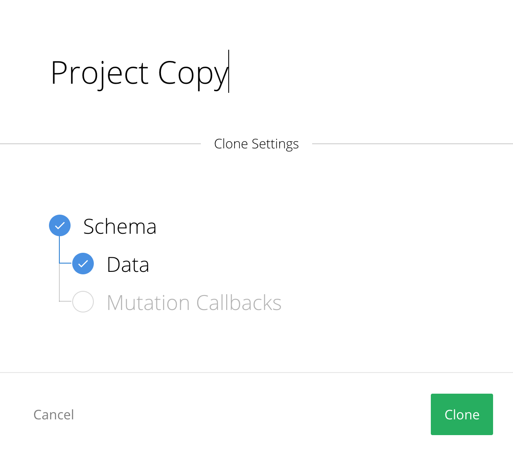

# Duplicating a Graphcool Project

Whether you want to quickly test a new feature or you need to configure a multi-stage environment, duplicating an existing Graphcool project comes in handy. With the Graphcool [Console](!alias-uh8shohxie) and [CLI](!alias-kie1quohli), you can choose the workflow that works best for you.

## Configuring the Project Copy

When copying an existing project, you need to choose the **name** of the new project following the [project name conventions](!alias-yahph3foch#project-names-and-aliases). Additionally, you can choose whether or not to **copy the data** from the existing project over to the new data as well.

Currently, the following settings will be automatically copied over to the duplicate project:

* For every enabled [**auth provider**](!alias-seimeish6e#authentication-providers), its configuration settings.
* If the [**Algolia integration**](!alias-emaig4uiki) is enabled, all Index Queries and configuration settings.
* All [**permissions**](!alias-iegoo0heez).

> Note: when copying over the data as well, **all files will be copied over to the other project as well**. If you delete a file in either the original or the copied project, it will be deleted in both projects.

No [functions](!alias-boo6uteemo) are currently being copied.

Several improvements to copying projects are being discussed [in this feature request](https://github.com/graphcool/feature-requests/issues/255). Join the discussion and add your thoughts!

## Using the Console

You can access the copy project feature both in the [**schema editor**](!alias-zezoo7uaph) as well as the [**project settings**](!alias-aechi6iequ).

## Using the CLI

Read how to copy an existing project with the CLI [in the reference documentation](!alias-aetoh3vad6#copying-an-existing-project). [This tutorial](!alias-ex4wo4zaep) goes more in-depth about managing a multi-stage development setup with the Graphcool CLI.
