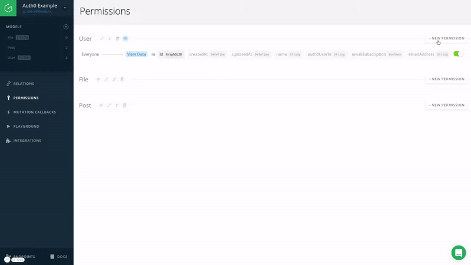
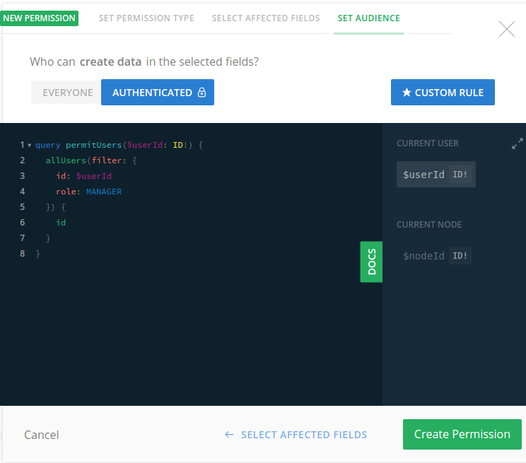
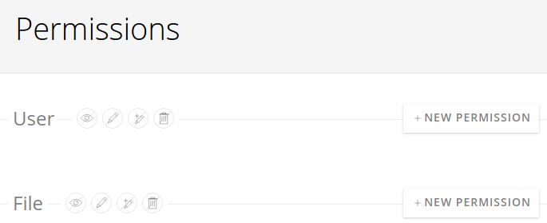

# Configuring Permissions For User Signup With GraphQL

With the [permission system](!alias-iegoo0heez) you can control who has access to which GraphQL queries and mutations. While the exact permissions depend on your individual needs, there are a few common permission setups regarding user authentication.

## Allow Everyone To Sign Up

Most applications will work best if signups are open to everyone - here's the permission setup we need for that:



Note that by choosing `Apply to whole type`, we select all current and future fields allowing a user signing up to set all the fields like a `name` or `emailAddress`.

Using the email auth provider it works like this:

```graphql
---
endpoint: https://api.graph.cool/simple/v1/ciwf90ykz03b20171wbj92kw2
disabled: true
---
mutation {
  createUser(
    emailSubscription: false
    emailAddress: "newuser@example.com"
    name: "New User"
    authProvider: {
      email: "newuser@example.com"
      email: {
        password: "password"
      }
    }
  ) {
    id
  }
}
---
{
  "data": {
    "createUser": {
      "id": "cizxzlcfkl4ug0109pav9bwfc"
    }
  }
}
```

In the above setting, we additionally allowed everyone to query the `id` of a user. If this is not what you want, you can disable that permission. When you now create a user, you'll get the following response:

```graphql
---
endpoint: https://api.graph.cool/simple/v1/ciwf90ykz03b20171wbj92kw2
disabled: true
---
mutation {
  createUser(
    emailSubscription: false
    emailAddress: "newuser@example.com"
    name: "New User"
    authProvider: {
      email: {
        email: "newuser@example.com"
        password: "password"
      }
    }
  ) {
    id
  }
}
---
{
  "data": {
    "createUser": null
  },
  "errors": [
    {
      "locations": [
        {
          "line": 29,
          "column": 5
        }
      ],
      "path": [
        "createUser",
        "id"
      ],
      "code": 3008,
      "message": "Insufficient Permissions",
      "requestId": "cizxzmxknjjxg0149k3jkilu3"
    }
  ]
}
```

Even though we receive a permission error, the user is still created because the `createUser` mutation is available to everyone - however, noone can query a user `id`. That's where the permission error is coming in.

## Only Allow Managers To Create New Accounts

You can use the advanced permission system to restrict user signup to certain user groups. This is useful if you are working on an internal application for example.

Let's introduce an enum field `role` with the possible values `USER` and `MANAGER` to the `User` type for demonstration purposes. Then we can use the following authenticated [permission query](!alias-iox3aqu0ee) with the `Create` operation on the `User` type.



This is the custom rule we're using:

```graphql
query permitUsers($userId: ID!) {
  someUserExists(filter: {
    id: $userId
    role: MANAGER
  })
}
```

Now only users with the `MANAGER` role are able to create new accounts - of course you need to create at least one manager in the Console to allow the creation of further accounts.

## Restrict The Creation Of New Accounts

Finally, you can remove or disable all permissions for the `Create` operation on the `User` type.



In this case, only the Console user and server-side functions using a [permanent authentication token](!alias-eip7ahqu5o#token-types) can create new users.
