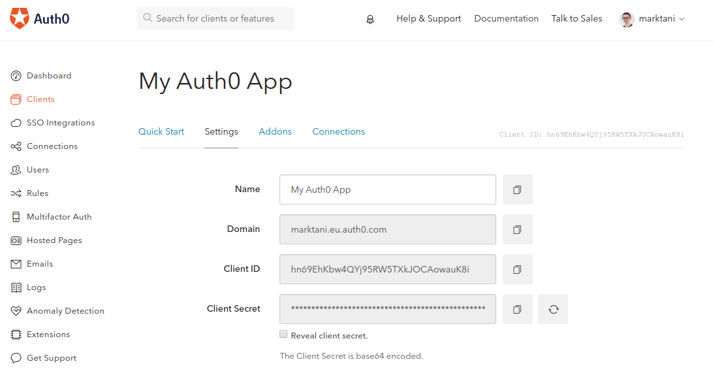

# Auth0 Integration

The Auth0 integration ties in seamlessly with the [authentication](!alias-wejileech9) and [permission system](!alias-iegoo0heez).

[Auth0](https://auth0.com/) is an external auth provider that allows your users to authenticate with different social logins like Facebook, Google, Twitter or other methods like Passwordless.

In your application, you can use [Auth0 Lock](https://auth0.com/lock) to offer a finished login experience.

## Activating the Auth0 Integration

In your Auth0 settings, create a new client or use an existing one. Copy the following parameters that you can find in the client settings:

* domain name
* client ID
* client secret

Enter the collected credentials in the Auth0 integration popup in the [Integration View]():

Read how this affects the `createUser` mutation to sign up users in the [API](!alias-eixu9osueb#auth0-social-logins) chapter.
