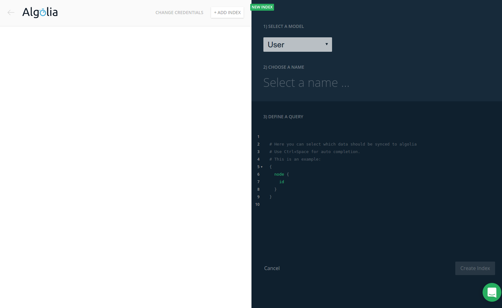

# Algolia Integration

The [Algolia](https://algolia.com) integration allows you to automatically synchronize your data with Algolia search indices. While the Graphcool APIs offer very flexible query arguments for [filtering](!alias-xookaexai0) or [ordering](vequoog7hu), Algolia is specialized in full-text searches and comes with prepared libraries to build great search experiences.

## Collect the needed Credentials

In your Algolia settings, copy the Algolia App Id and create a new API key with **Add Records** and **Delete Records** enabled:

## Activate the Algolia Integration

Enter the collected credentials in the Algolia integration popup in the Console:

## Create new Search Indices

* select the model that you want to define the index on
* enter the name of the search index. This name needs to be entered in your application as well!
* enter the query that defines the structure of the search index

