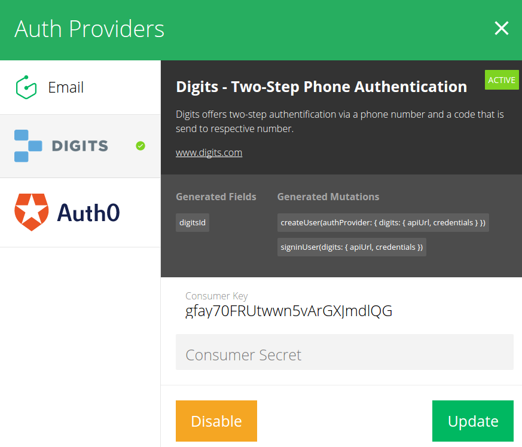

# Digits Integration

The Digits integration ties in seamlessly with the [authentication](!alias-wejileech9) and [permission system](!alias-iegoo0heez).

## Collect the needed Credentials

In your [Digits](https://get.digits.com/) settings, create a new app or use an existing one. Copy the following parameters that you can find in the app settings:

* Consumer Key
* Consumer Secret

## Activate the Digits Integration

Enter the collected credentials in the Digits integration popup:

