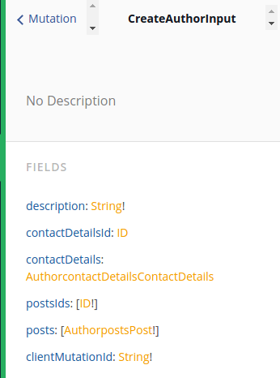

# Nested Create Mutations in the Relay API

Nested create mutations connect the created node to a new node in the related model.
Let's assume the following schema:

```idl
type Author {
  id: ID!
  contactDetails: ContactDetails
  posts: [Post]
  description: String!
}

type ContactDetails {
  id: ID!
  author: Author
  email: String!
}

type Post {
  id: ID!
  text: String!
  author: Author
}
```

We're considering the `createAuthor` and `updateAuthor` mutation to see how to create nested nodes for the *to-one* relation `AuthorContactDetails` and the *to-many* relation `AuthorPosts`.

## Nested Create Mutations for to-one Relations

Let's explore the available nested create mutations for the `one-to-one` relation `AuthorContactDetails`.

#### Creating a new Author node and connect it to new ContactDetails

```graphql
---
endpoint: https://api.graph.cool/relay/v1/ciz751zxu2nnd01494hr653xl
disabled: true
---
mutation createAuthorAndContactDetails {
  createAuthor(
    input: {
      description: "I am a good author!"
      contactDetails: {
      	email: "nilan@graph.cool"
      }
      clientMutationId: "abc"
    }
  ) {
    author {
      description
    }
    contactDetails {
      email
    }
  }
}
---
{
  "data": {
    "createAuthor": {
      "author": {
        "description": "I am a good author!"
      },
      "contactDetails": {
        "email": "nilan@graph.cool"
      }
    }
  }
}
```

Note the nested `contactDetails` object that takes the same input arguments as the `createContactDetails` mutation. After running this mutation, new author and contact detail node have been created that are now connected via the `AuthorContactDetails` relation.

Here's the same mutation using GraphQL variables:

```graphql
---
endpoint: https://api.graph.cool/relay/v1/ciz751zxu2nnd01494hr653xl
disabled: true
---
mutation createAuthorAndContactDetails($contactDetails: AuthorcontactDetailsContactDetails) {
  createAuthor(
    input: {
      description: "I am a good author!"
      contactDetails: $contactDetails
      clientMutationId: "abc"
    }
  ) {
    author {
      description
    }
    contactDetails {
      email
    }
  }
}
---
{
  "contactDetails": {
    "email": "nilan@graph.cool"
  }
}
---
{
  "data": {
    "createAuthor": {
      "author": {
        "description": "I am a good author!"
      },
      "contactDetails": {
        "email": "nilan@graph.cool"
      }
    }
  }
}
```

Note the variable type `AuthorcontactDetailsContactDetails` that follows a consistent naming schema:

* The original model name `Author`
* The related field name `contactDetails`
* The related model name `ContactDetails`

You can also find the type name in the documentation in the Playground:


#### Updating an existing Author and connect it to new ContactDetails

Similarly, we can update an author and simultaneously create new contact details for that author:

```graphql
---
endpoint: https://api.graph.cool/relay/v1/ciz751zxu2nnd01494hr653xl
disabled: true
---
mutation updateAuthorAndCreateContactDetails($contactDetails: AuthorcontactDetailsContactDetails) {
  updateAuthor(
    input: {
      id: "ciz7573ffx1w70112hwj04hqv"
      description: "I write posts"
      contactDetails: $contactDetails
      clientMutationId: "abc"
    }
  ) {
    author {
      description
    }
    contactDetails {
      email
    }
  }
}
---
{
  "contactDetails": {
    "email": "johannes@graph.cool"
  }
}
---
{
  "data": {
    "updateAuthor": {
      "author": {
        "description": "I write posts"
      },
      "contactDetails": {
        "email": "johannes@graph.cool"
      }
    }
  }
}
```

## Nested Create Mutations for to-many Relations

Let's explore the available nested create mutations for the `one-to-many` relation `AuthorPosts`.

#### Creating a new Author node and connect it to multiple new Posts

```graphql
---
endpoint: https://api.graph.cool/relay/v1/ciz751zxu2nnd01494hr653xl
disabled: true
---
mutation createAuthorAndPosts($posts: [AuthorpostsPost!]) {
  createAuthor(
    input: {
      description: "I am a good author!"
      posts: $posts
      clientMutationId: "abc"
    }
  ) {
    author {
      description
      posts {
        count
      }
    }
  }
}
---
{
  "posts": [{
    "text": "A post of mine"
  }, {
    "text": "Another post"
  }]
}
---
{
  "data": {
    "createAuthor": {
      "author": {
        "description": "I am a good author!",
        "posts": {
          "count": 2
        }
      }
    }
  }
}
```

Note the nested `posts` object that takes a list of arguments needed for the `createPost` mutation. After running this mutation, new author and post nodes have been created that are now connected via the `AuthorPosts` relation.

Here's the same mutation using GraphQL variables:

```graphql
endpoint: https://api.graph.cool/relay/v1/ciz751zxu2nnd01494hr653xl
disabled: true
---
```

Note the variable type `[AuthorpostsPost!]` that follows a consistent naming schema:

* The original model name `Author`
* The related field name `posts`
* The related model name `Post`

You can also find the type name in the documentation in the Playground:



#### Updating an existing Author and Connecting it to multiple new Posts

Similarly, we can update an author and simultaneously create multiple new posts for that author:

```graphql
---
endpoint: https://api.graph.cool/relay/v1/ciz751zxu2nnd01494hr653xl
disabled: true
---
mutation updateAuthorAndConnectToPosts($postsIds: [ID!]) {
  createAuthor(
    input: {
      description: "I am a good author!"
      postsIds: $postsIds
      clientMutationId: "abc"
    }
  ) {
    author {
      description
      posts {
        count
      }
    }
  }
}
---
{
  "postsIds": ["ciz787j6eqmf5014929vvo2hp", "ciz787j6eqmf60149lg3jvi4r"]
}
---
{
  "data": {
    "createAuthor": {
      "author": {
        "description": "I am a good author!",
        "posts": {
          "count": 2
        }
      }
    }
  }
}
```
