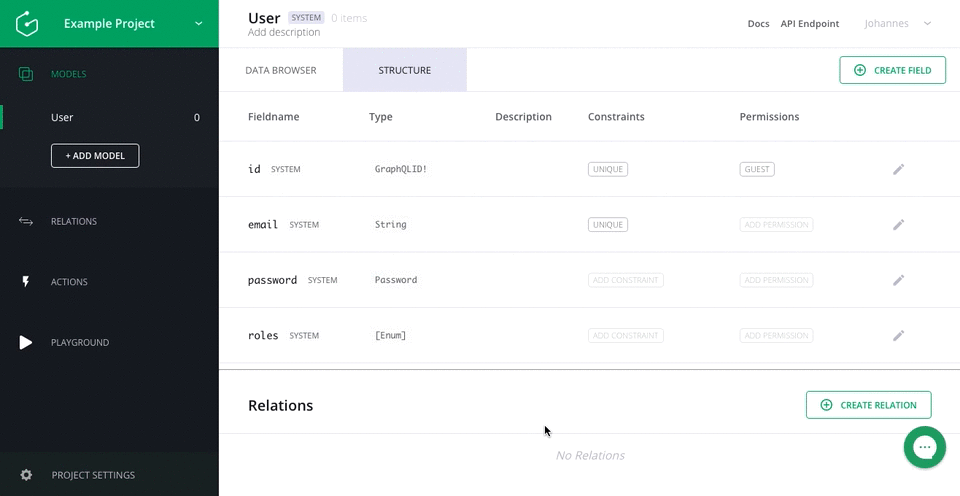
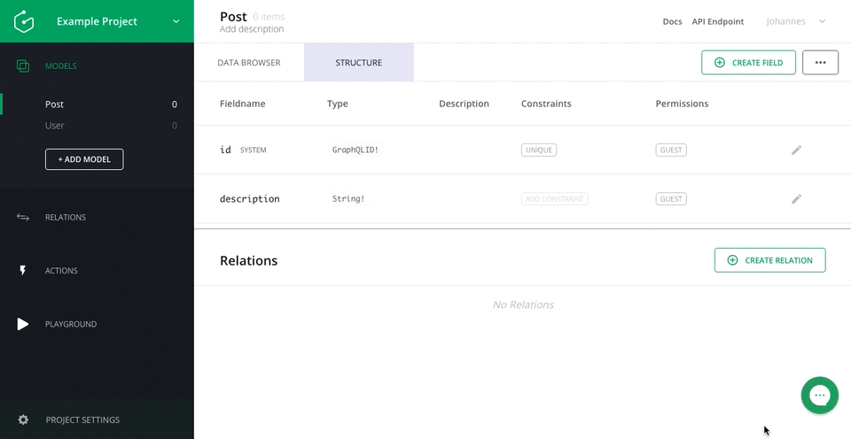
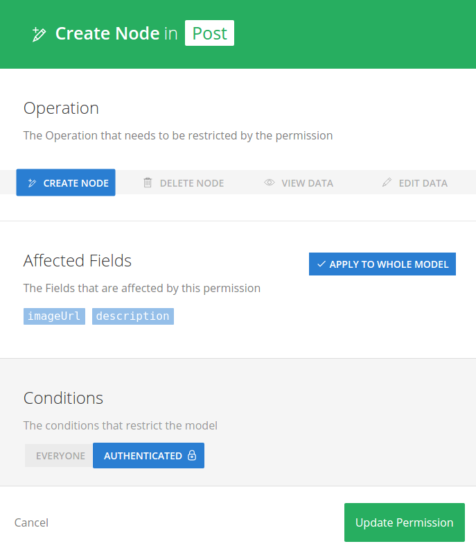

# User Authentication with Digits for React and Apollo

In this guide we will have a closer look at how auth providers and the permission system tie together when using a Graphcool project.
You will learn how to configure Digits and use it in combination with React and Apollo to handle user login and sign up and what permission setup is needed to get started with authentication.

> If you want to follow along, make sure to finish the [introduction guide](!alias-thaeghi8ro) on how to set up a GraphQL backend in less than 5 minutes.

We will build a similar Instagram clone application as before, but add a few changes. In this application, everyone will be able to see posts but only authenticated users should be able to create new posts. When a new user signs up, he has to enter his name and email address  and state if he is interested in notification emails.

> You can find the complete [example on GitHub](https://github.com/graphcool-examples/react-apollo-digits-example).

## 1. Preparation

In this step we will connect your Graphcool project to your Digits account.

### 1.1 Create new Digits application

If you have no Digits account yet, head over to their [website](https://get.digits.com/) and create a new iOS or Android App to obtain the needed credentials for the Digits integration. After successfully creating the app, copy your *consumer key* and *consumer secret*.

### 1.2 Configure Digits with Graphcool

In the [console](https://console.graph.cool), let's create a new project so we can freely experiment with Digits. Head over to the `User` model of your new project, select *Configure Auth Providers*, enable Digits and enter the information collected from above.

Now it's time to design our data schema.

## 2. Setting up the project

### 2.1 Setting up the data schema

As before, we want to create a `Post` model which the String fields `imageUrl` and `description`.
In order to do that, please open your [console](https://console.graph.cool) and add a new model called `Post`.



Now create the fields `imageUrl` and `description` of type String.



We also add three required fields to the `User` model. Go to your `User` model and create the three required fields `emailSubscription` of type boolean and `name` and `emailAddress` of type String.

### 2.2 Setting the permissions

To make our application behave correctly we have to setup permissions for the `Post` and `User` model in our project.

As we want to restrict the creation of posts only to `AUTHENTICATED` users, we have to create the according permission for `Create Node` on the `Post` model.



To allow everyone to see posts, we have to add a `EVERYONE` permissions for `View Data` as well.
Make sure that these two permissions are the only enabled ones, otherwise the final permissions might be too restrictive or too relaxed.


As we want to allow `EVERYONE` to signup with Digits, we create the according `Create Node` permission on the `User` model.


We also allow `EVERYONE` to view users by creating a new permission for `View Data`.


## 3. Building the application

That's it, we are done configuring the project and we can start working on our frontend application! First, let's have a closer look at how we can use Digits in React.

### 3.1 Setting up Apollo Client for user authentication

We will use [Apollo Client](http://dev.apollodata.com/) to make GraphQL requests in our React application.
In Graphcool, requests are authenticated using the `Authorization` header. That's why we include it in every request if the user already signed in. We can use `applyMiddleware` on the `networkInterface` to accomplish this:
```js
// in src/index.js
const networkInterface = createNetworkInterface({ uri: 'https://api.graph.cool/simple/v1/__PROJECT_ID__' })

networkInterface.use([{
  applyMiddleware (req, next) {
    if (!req.options.headers) {
      req.options.headers = {}
    }

    // get the authentication token from local storage if it exists
    if (localStorage.getItem('graphcoolToken')) {
      req.options.headers.authorization = `Bearer ${localStorage.getItem('graphcoolToken')}`
    }
    next()
  },
}])
```

Now we can create the Apollo Client instance `client` and pass it to `ApolloProvider` which exposes its functionality to all the React components we use. We also set up our routes using `react-router`.

```js
// in src/index.js
const client = new ApolloClient({ networkInterface })

ReactDOM.render((
  <ApolloProvider client={client}>
    <Router history={browserHistory}>
      <Route path='/' component={App} />
      <Route path='create' component={CreatePost} />
      <Route path='signup' component={CreateUser} />
    </Router>
  </ApolloProvider>
  ),
  document.getElementById('root')
)
```

As you can see, we have three routes:

* `/`, where we render our main app. Here the user can see a list of posts and login with Digits. A logged in user can logout and create new posts here.

* `create`, where the user can create new posts if logged in

* `signup`, where a new user can sign up. To sign up, a user has to provide his name and email address and can decide to get email notifications.

### 3.2 Handling authenticated status

Even though we are sending a token in every request after the user signed in, it might be not valid, or a user might tamper with the actual token in the local storage. To check if a request is actually authenticated, we use the `user` query in our main component, `App.js`:

```js
// in src/components/App.js
//...
const userQuery = gql`
  query {
    user {
      id
    }
  }
`

export default graphql(userQuery, { options: {forceFetch: true }})(withRouter(App))
```

We use the option `forceFetch` here to make sure we are querying the user every time from the server and don't use Apollo Client's cache for this particular query. We can use the user query to determine the rendering of our main app:

```js
// in src/components/App.js
//...
_isLoggedIn = () => {
  return this.props.data.user
}
//...
```

To log out, we can simply remove the authentication token from local storage and reload to cleanly reset Apollo Client's cache:
```js
_logout = () => {
// in src/components/App.js
//...
// remove token from local storage and reload page to reset apollo client
window.localStorage.removeItem('graphcoolToken')
location.reload()
//...
}
```

We use the logged in status to either render a login button or a logout button and a new post button in case the user is already logged in.

There are a few reasons we are force fetching the user in every request. For example, a user might be logged in for a long time already, and the authentication token already expired. If you make another query or mutation and included an invalid authentication token for whatever reason, you will get a error message. You could add additional logic to your application that identifies this situation with the help of the returned error and prompts the user to login again when the token expired. In our example we will simply redirect if the user query doesn't return what we expect.

We will use the user query to check if the user is authenticated in a few other components as well.

### 3.3 Using the Digits SDK in React

Digits provides an SDK hosted at `https://cdn.digits.com/1/sdk.js` that offers a popup for users to login with Digits. In `index.html`, we include the SDK in a `script` tag:

```html
<!-- in index.html -->
<script id="digits-sdk" src="https://cdn.digits.com/1/sdk.js"></script>
```

In our main component `App`, we have to initialize Digits like this:

```js
// in src/components/App.js
//...
componentDidMount() {
  if (!window.digitsInitialized) {
    Digits.init({ consumerKey: '__CONSUMER_KEY__' })
      .done(() => {
        window.digitsInitialized = true
        console.log('Digits is initialized')
      })
      .fail(() => {
        console.log('Digits failed to initialize')
      })
  }
}
//...
```

Make sure to replace `__CONSUMER_KEY__` with your Digits consumer key.

### 3.4 Handling user login

We use the Digits SDK in the `LoginDigits` component where we call the `signinUser` mutation if the Digits login is successful:

```js
// in src/components/LoginDigits.js
const signinUser = gql`
  mutation ($credentials: String!, $apiUrl: String!) {
    signinUser(digits: {credentials: $credentials, apiUrl: $apiUrl}) {
      token
    }
  }
`

export default graphql(signinUser, {name: 'signinUser'})(
  withRouter(LoginDigits)
)
```

When the user clicks the login button and successfully logins with Digits, we run the `signinUser` mutation with the obtained credentials:

```js
// in src/components/LoginDigits.js
_successfulLogin = (loginResponse) => {
  var oAuthHeaders = loginResponse.oauth_echo_headers
  var variables = {
    credentials: oAuthHeaders['X-Verify-Credentials-Authorization'],
    apiUrl: oAuthHeaders['X-Auth-Service-Provider']
  }

  this.props.signinUser({variables})
    .then((response) => {
      window.localStorage.setItem('graphcoolToken', response.data.signinUser.token)
      this.props.router.replace('/')
      location.reload()
    }).catch((e) => {
    console.error(e)
    this.props.router.replace('/')
  })
}
```

If the `signinUser` mutation succeeded, we save the authentication token obtained as a response from the `signinMutation` in local storage to authenticate further requests as discussed above.

After the successful mutations (or an error), we redirect the user back to `/` where he now can see the `+ New Post` button.

### 3.5 Handling user signup

For the route `/signup` we use the `CreateUser` component. We need to supply the `createUser` and `signinUser` mutations and the `user` query to the inner component using the `graphql` helper method of `react-apollo`:

```js
// in src/components/CreateUser.js
const createUser = gql`
  mutation ($credentials: String!, $apiUrl: String!, $emailAddress: String!, $name: String!, $emailSubscription: Boolean!) {
    createUser(authProvider: {digits: {credentials: $credentials, apiUrl: $apiUrl}}, emailAddress: $emailAddress, name: $name, emailSubscription: $emailSubscription) {
      id
    }
  }
`

const signinUser = gql`
  mutation ($credentials: String!, $apiUrl: String!) {
    signinUser(digits: {credentials: $credentials, apiUrl: $apiUrl}) {
      token
    }
  }
`

const userQuery = gql`
  query {
    user {
      id
    }
  }
`

export default graphql(createUser, {name: 'createUser'})(
  graphql(userQuery, { options: { forceFetch: true }})(
    graphql(signinUser, {name: 'signinUser'})(
      withRouter(CreateUser))
    )
)
```

Note that we again use the query option `forceFetch` to ensure that the query is actually sent to the GraphQL server, instead of using a potential cached version of the user.

Then we can focus on the `render` method of the `CreateUser` component. Here, we make a few checks to verify that

* the `data` from Apollo has already finished loading

* there is no logged in user yet

* Digits has been initialized

```js
// in src/components/CreateUser.js
render () {
  if (this.props.data.loading) {
    return (<div>Loading</div>)
  }

  // redirect if user is logged in
  if (this.props.data.user) {
    console.warn('already logged in')
    this.props.router.replace('/')
  }

  if (!window.digitsInitialized) {
    console.warn('Digits not initialized')
    this.props.router.replace('/')
  }
// ...
}
```

If data has finished loading and no user is already logged in, we render the input elements needed for the sign up form. If the user entered the needed information, we additionally render a button to finish the sign up:
```js
// in src/components/CreateUser.js
render () {
// ...
  {this.state.name && this.state.emailAddress &&
  <button className='pa3 bg-black-10 bn dim ttu pointer' onClick={this.createUser}>Log in</button>
  }
//...
}
```

When the user clicks the button, we call the `createUser` method where we first collect the needed variables, use the Digits popup to let the user sign in and then execute the `createUser` mutation with the collected variables and the Digits credentials:

```js
// in src/components/CreateUser.js
createUser = () => {
  const {emailAddress, name, emailSubscription} = this.state

  Digits.logIn() // eslint-disable-line no-undef
    .done((loginResponse) => {
      var oAuthHeaders = loginResponse.oauth_echo_headers
      const credentials = oAuthHeaders['X-Verify-Credentials-Authorization']
      const apiUrl = oAuthHeaders['X-Auth-Service-Provider']

      this.props.createUser({variables: {emailAddress, name, emailSubscription, apiUrl, credentials}})
        .then((response) => {
          this.props.signinUser({variables: {credentials, apiUrl}})
            .then((response) => {
              window.localStorage.setItem('graphcoolToken', response.data.signinUser.token)
              this.props.router.replace('/')
            }).catch((e) => {
            console.error(e)
            this.props.router.replace('/')
          })
        }).catch((e) => {
        console.error(e)
        this.props.router.replace('/')
      })
    })
    .fail((e) => {
      console.error(e)
      this.props.router.replace('/')
    })}
```

If the `createUser` mutation succeeded, we are signing in the user right away and save the authentication token obtained as a response from the `signinMutation` in local storage to authenticate further requests as discussed above.

After the successful mutations (or an error), we redirect the user back to `/` where he now can see the `+ New Post` button.

### 3.5 Creating new posts

Finally, let's have a look at the component `CreatePost` where a signed in user can create new posts. Again, we are wrapping the inner component with `graphql` from `react-apollo`:

```js
const createPost = gql`
  mutation ($description: String!, $imageUrl: String!){
    createPost(description: $description, imageUrl: $imageUrl) {
      id
    }
  }
`

const userQuery = gql`
  query {
    user {
      id
    }
  }
`

export default graphql(createPost)(
  graphql(userQuery, { options: { forceFetch: true }} )(withRouter(CreatePost))
)
```

Again, we are using `forceFetch` for the user query to ensure we don't use Apollo's cache for this query. We use this query again to check if the user is signed in or not and redirect to `/` if the user is not signed in:

```js
// in src/components/CreatePost.js
render () {
  //...
  if (!this.props.data.user) {
    console.warn('only logged in users can create new posts')
    this.props.router.replace('/')
  }
  //...
}
```

If the user is signed in and once the data has finished loading, we render two text inputs for the description and image url and a button to create the new post.

## 4. Try it out yourself

If you want to run the example on your own and experiment a bit with the a application yourself, checkout the code at [GitHub](https://github.com/graphcool-examples/react-apollo-digits-example). If you've already setup the data schema and Digits auth provider for your project, you only have to inject your simple API endpoint in `src/index.js`, enter your `consumerKey` in `src/components/App.js` and run `yarn && yarn start` and you're good to go!

Make sure to try things that shouldn't be allowed, like visiting the `/create` route without being logged in or using a fake authentication token in local storage. Have fun!

## 5. Next steps

Great, you set up everything that's needed for authentication in your Graphcool project, built a React application that uses Apollo and Digits to let user sign up or login and let them see or create posts.

As a next step, you could create a relation between `User` and `Post` and associate posts with their author. Find out more about relations in [this guide](!alias-daisheeb9x).

You can also [send notification emails using mutation callbacks, webtask and Mailgun](!alias-saigai7cha) or [trigger Slack notifications using mutation callbacks and Zapier](!alias-dah6aifoce).
