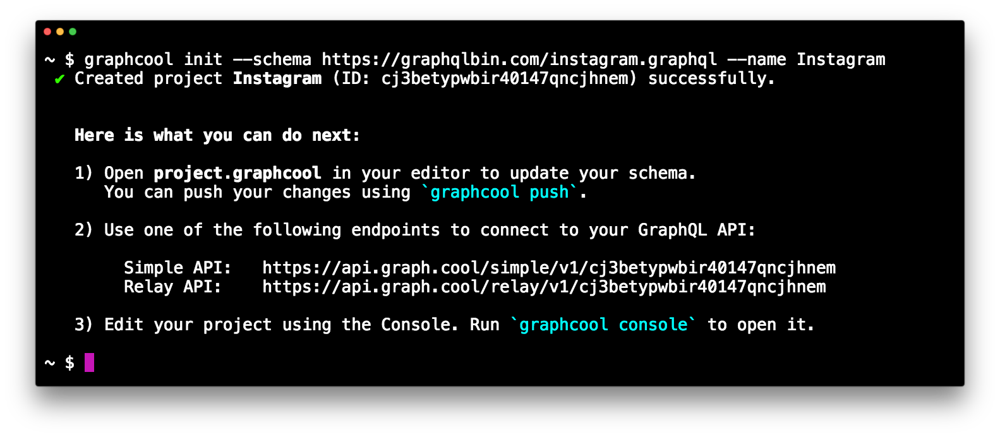
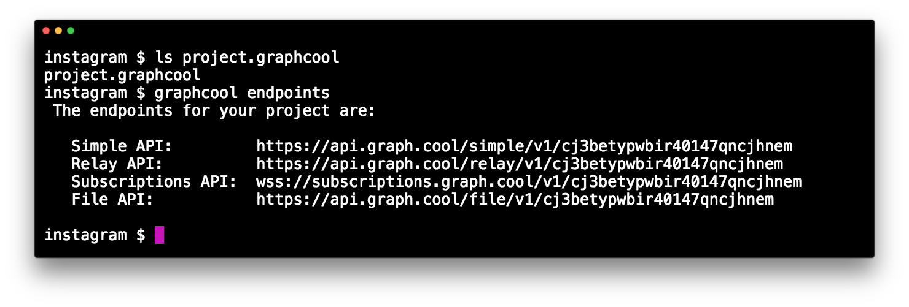
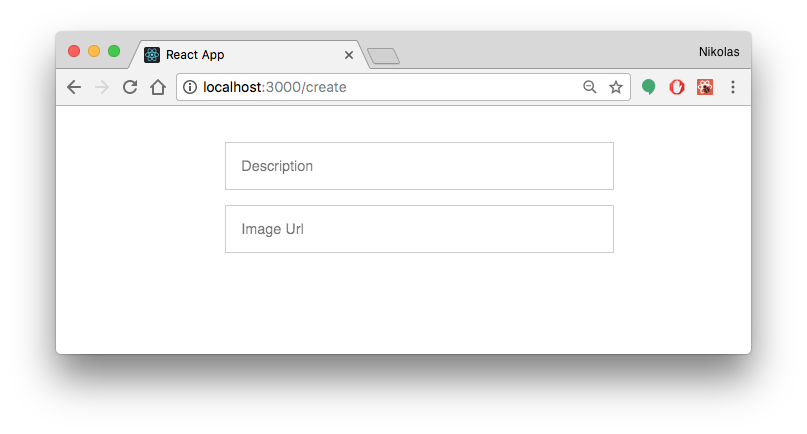
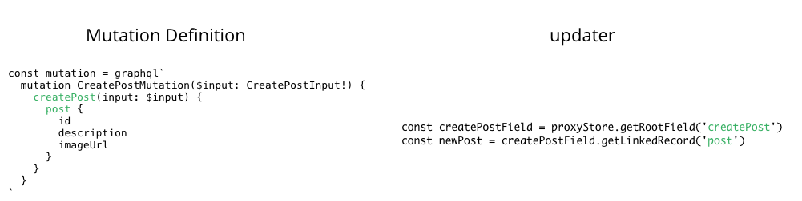

# Getting Started with Relay Modern

[Realy Modern](https://facebook.github.io/relay/docs/relay-modern.html) is the very promising evolution and first 1.0-release of Facebook's homegrown GraphQL client _Relay_. It was announced at this year's F8 conference and officially released by Lee Byron during [his talk](https://www.youtube.com/watch?v=OdsMz7h_Li0) at React Europe.

This post is a step-by-step tutorial with the goal of building a simple Instagram application from scratch using [`create-react-app`](https://github.com/facebookincubator/create-react-app). You can take a look at the final version of the code [here](https://github.com/graphcool-examples/react-graphql/tree/master/quickstart-with-relay-modern), just follow the instructions in the README to get up-and-running.

<iframe width="560" height="315" src="https://www.youtube.com/embed/XeALXh37WeU" frameborder="0" allowfullscreen></iframe>


If you've been using Relay Classic before and are looking to migrate, check out [this tutorial](!alias-eijooto4se) about Relay's Compatability API.

<!-- alias:section1 -->

## Relay - A Brief History

[Relay](https://facebook.github.io/relay/) and [Apollo](https://www.apollodata.com) are currently the most popular and sophisticated [GraphQL clients](https://dev-blog.apollodata.com/why-you-might-want-a-graphql-client-e864050f789c) available.

Apollo is a very community-driven effort to build a flexible and easy-to-understand client that let's get you get started quickly with GraphQL on the frontend. In only a bit more than a year it has become a powerful solution for people looking to use GraphQL in web (and mobile!) projects.

Relay on the other hand is a project whose key ideas grew while Facebook was using the early versions of GraphQL in their native mobile apps starting 2012. Facebook took the learnings they gathered from using GraphQL in their native apps to build a declarative data management framework that integrates well with React. For Relay becoming open-source, much like with GraphQL, it was pulled out of Facebook's infrastructure with the ambition to build a data loading and storage solution that would also work in non-Facebook projects.

Apollo and Relay have different focus areas. Where Apollo optimizes for flexibilty and simplicity, one of Relay's key goals is performance.

> Relay Modern [...] incorporates the learnings and best practices from classic Relay, our native mobile GraphQL clients, and the GraphQL community. Relay Modern retains the best parts of Relay — colocated data and view definitions, declarative data fetching — while also simplifying the API, adding features, improving performance, and reducing the size of the framework. [Relay Modern: Simpler, faster, more extensible](https://code.facebook.com/posts/1362748677097871/relay-modern-simpler-faster-more-extensible/)

If you want to take a deep-dive into Relay Modern, make sure to check out [this article](https://dev-blog.apollodata.com/exploring-relay-modern-276f5965f827) on the Apollo blog.


## 1. Preparing the Project

### Creating the App

The first step you'll do is to create the project using `create-react-app`, a simple command-line tool that let's you create React applications without any configuration overhead.

Open a terminal window and type the following:

```sh
# If necessary, install `create-react-app`
npm install -g create-react-app

# Create React app called `instagram` (and navigate into it)
create-react-app instagram
cd instagram
```

### Creating the Server

On the backend, you'll use a GraphQL API provided by Graphcool. As with `create-react-app`, you use the [Graphcool CLI](!alias-kie1quohli) to generate it:

```sh
# If necessary, install `graphcool`
npm install -g graphcool

# Create Graphcool project called `Instagram`
graphcool init --schema https://graphqlbin.com/instagram.graphql --name Instagram
```

The remote schema file that you're using here contains the following data model (written in [GraphQL IDL](!alias-kr84dktnp0) syntax):

```graphql
type Post {
  description: String!
  imageUrl: String!
}
```

This is what it should look like in your terminal:



Note that you can now manage this project in the [Graphcool Console](https://console.graph.cool). If you want to manage it locally, you can use the [project file](!alias-ow2yei7mew) `project.graphcool` to make local changes to the schema and then apply them by calling `graphcool push`.

## 2. Connecting with Relay

The next step is to connect your React app with the Relay API on the server. You'll take the following steps to achieve this:

1. Add Relay dependencies
2. Eject from `create-react-app` to configure Babel
3. Configure the Relay Environment

Let's jump right in!


### 1. Add Relay Dependencies

You first have to install several dependencies to pull in the different pieces that are required for Relay to work.

In the terminal window, first install the general `react-relay` package that was recently upgraded to version 1.0:

```sh
yarn add react-relay
```

This dependency allows you to access all major Relay APIs, such as the [`QueryRenderer`](https://facebook.github.io/relay/docs/query-renderer.html) or [`FragmentContainer`](https://facebook.github.io/relay/docs/fragment-container.html) that you'll explore in a bit!

Next you need the two dependencies that make for much of the performance benefits in the Relay architecture through ahead-of-time optimizations: The [`relay-compiler`](https://facebook.github.io/relay/docs/relay-compiler.html) and [`babel-plugin-relay`](https://facebook.github.io/relay/docs/babel-plugin-relay.html). Both are installed as `dev` dependencies using the `--dev` option:

```sh
yarn add relay-compiler --dev
```

and

```sh
yarn add babel-plugin-relay --dev
```

All right, that's it for the first step! Go ahead and move on to configure Babel.


### 2. Eject from `create-react-app` to configure Babel

`create-react-app` hides all the build tooling configurations from you and provides a comfortable spot for starting out. However, in your case you actually need to do some custom [Babel](https://babeljs.io/) configurations to get Relay to work. So you need to [_eject_](https://facebook.github.io/react/blog/2016/07/22/create-apps-with-no-configuration.html#no-lock-in) from `create-react-app`.

In the terminal, use the following command:

```sh
yarn eject
```

This will change the folder structure to look as follows:

```sh
.
├── README.md
├── config
│   ├── env.js
│   ├── jest
│   ├── paths.js
│   ├── polyfills.js
│   ├── webpack.config.dev.js
│   ├── webpack.config.prod.js
│   └── webpackDevServer.config.js
├── package.json
├── public
│   ├── favicon.ico
│   ├── index.html
│   └── manifest.json
├── scripts
│   ├── build.js
│   ├── start.js
│   └── test.js
├── src
│   ├── App.css
│   ├── App.js
│   ├── App.test.js
│   ├── index.css
│   ├── index.js
│   ├── logo.svg
│   └── registerServiceWorker.js
└── yarn.lock
```

This command essentially opens up the _blackbox_ that was handed to you by `create-react-app` and let's you do the build configuration yourself.

In this case, you need to add the `babel-plugin-relay` that you installed in the previous step to the build process. Open `package.json` and add the `relay` plugin by modifying the `babel` section like so:

```js
"babel": {
  "presets": [
    "react-app"
  ],
  "plugins": [
    "relay"
  ]
},
```

That's it already for the Babel configuration. Set up the Relay Environmnent in the app next!


### 3. Configure the Relay Environment

The [Relay Environment](https://facebook.github.io/relay/docs/relay-environment.html) provides the core of the Relay functionality at runtime by "[bundling] together the configuration, cache storage, and network-handling that Relay needs in order to operate."

A Relay Environment needs to be instantiated with two major components:

1. A `Network` that knows which GraphQL server it can talk to
2. A `Store` that takes care of the caching

To achieve this, create new file in the project's `src` directory called `Environment.js` and add the following code to it:

```js
// 1
const {
  Environment,
  Network,
  RecordSource,
  Store,
} = require('relay-runtime')

// 2
const store = new Store(new RecordSource())

// 3
const network = Network.create((operation, variables) => {
  // 4
  return fetch('__RELAY_API_ENDPOINT__', {
    method: 'POST',
    headers: {
      'Accept': 'application/json',
      'Content-Type': 'application/json'
    },
    body: JSON.stringify({
      query: operation.text,
      variables,
    }),
  }).then(response => {
    return response.json()
  })
})

// 5
const environment = new Environment({
  network,
  store,
})

// 6
export default environment
```

This code has been taken from the example in the [docs](https://facebook.github.io/relay/docs/relay-environment.html#a-simple-example) and was only slightly customised.

Let's quickly discuss the commented sections to understand better what's going on:

1. You first import the required JS modules that you need to instantiate and configure the `Environment`.
2. Here you instantiate the required `Store` that will store the cached data.
3. Now you create a `Network` that knows your GraphQL server from before, it's instantiated with a function that returns a `Promise` of a networking call to the GraphQL API - here that's done using `fetch`.
4. At this point, you need to **replace `__RELAY_API_ENDPOINT__` with your endpoint for the `Relay API`**
5. With the `store` and `network` available you can instantiate the actual `Environment`.
6. Lastly you need to export the `environment` from this module.

Awesome, you're now ready to use Relay in your app 🚀

> Note: If you lose the endpoint for your GraphQL API, you can always find it in the [Graphcool Console](https://console.graph.cool) (by clicking in _ENDPOINTS_-button on the bottom-left) or use the `graphcool endpoints` command in the same directory where the project file `project.graphcool` is located:
> 

<!-- alias:section2 -->


## 3. Displaying all Posts

### Preparing React Components

Before doing anything else, go ahead and prepare the React components.

You'll use [Tachyons](http://tachyons.io/) to ease working with CSS in this project. Open `public/index.html` and add a third `link` tag to in the `head` section so that it looks like this:

```html
<link rel="manifest" href="%PUBLIC_URL%/manifest.json">
<link rel="shortcut icon" href="%PUBLIC_URL%/favicon.ico">
<link rel="stylesheet" href="https://unpkg.com/tachyons@4.2.1/css/tachyons.min.css"/>
```

First create a new file called `Post.js` in the `src` directory that will represent an individual post. Paste the following code into the empty file:

```js
import React from 'react'

class Post extends React.Component {

  render () {
    return (
      <div className='pa3 bg-black-05 ma3'>
        <div
          className='w-100'
          style={{
            backgroundImage: `url(${this.props.post.imageUrl})`,
            backgroundSize: 'cover',
            paddingBottom: '100%',
          }}
        />
        <div className='pt3'>
          {this.props.post.description}&nbsp;
          <span className='red f6 pointer dim' onClick={this._handleDelete}>Delete</span>
        </div>
      </div>
    )
  }

  _handleDelete = () => {
  }
}

export default Post
```

That's a simple `Post` component that displays the image and the description for each post. You'll implement the `_handleDelete` method in a bit.

Next, add another file, again in the `src` directory and call it `ListPage.js`. Implement it as follows:

```js
import React from 'react'
import Post from './Post'

const mockPostData = [
  {
    node: {
      id: "1",
      description: "Howdy Partner",
      imageUrl: "http://www.cutestpaw.com/wp-content/uploads/2015/09/s-Howdy-partner.jpeg"
    }
  },
  {
    node: {
      id: "2",
      description: "Ice Cream!",
      imageUrl: "https://s-media-cache-ak0.pinimg.com/originals/b9/ba/b9/b9bab9dcacb9efde92e015af07834473.jpg"
    }
  }
]

class ListPage extends React.Component {

  render () {
    return (
      <div className='w-100 flex justify-center'>
        <div className='w-100' style={{ maxWidth: 400 }}>
          {mockPostData.map(({node}) =>
            <Post key={node.id} post={node} />
          )}
        </div>
      </div>
    )
  }

}

export default ListPage
```

This `ListPage` component simply renders a list of `Post` components by mapping over an array of posts. For now these are posts that you define statically in the `mockPostData` array, but you'll soon replace that to fetch the actual posts from the server!

To finish up this section, open `App.js` and replace its contents with the following:

```js
import React, { Component } from 'react'
import ListPage from './ListPage'

class App extends Component {
  render() {
    return (
      <ListPage />
    )
  }
}

export default App
```

The `App` is the root component for your application, so you tell it to render the `ListPage` that will be the initial screen of the app.

With this setup, you can finally run the app. Type the following in the terminal:

```sh
yarn start
```

This will open up a browser and load the app from `http://localhost:3000` where you'll now see two lovely pigs:


### Load Data from Server

As lovely as these pigs are, they're only loaded from memory instead of the network which definitely wasn't the goal of this exercise. Instead, you want to store the posts in the database on the server and then load them using GraphQL and Relay!

Before you go and make the required changes, a bit of theory!

#### Colocation and GraphQL Fragments

One of the most powerful concepts of Relay is called _colocation_. This means that a React component declares its data dependencies right next to (i.e. in the same file) where it's defined. This happens in the form of [GraphQL fragments](http://graphql.org/learn/queries/#fragments).

This effectively means that you'll never write any actual GraphQL queries yourself. This is unlike the approach that's taken in Apollo, where you're also able to coloate data dependencies and React components - but are most commonly doing so by writing actual _queries_ instead of _fragments_.

But if you're never writing any queries in Relay, how can the GraphQL server respond with sensible data?

That's the cool part about Relay! Under the hood, it will figure out the most efficient way for your React components to fetch the data that's required for them to render, based on the data dependencies they declared in their fragments.

You don't have to worry about fetching the data one bit - all networking and caching logic is abstracted away and you can focus on writing your React components and what data they need! Declarative data fetching ftw 😎

#### Fragment Containers

The way to declare the data dependencies alongside your React components is by using the [`FragmentContainer`](https://facebook.github.io/relay/docs/fragment-container.html) API.

The function `createFragmentContainer` is a higher-order component that takes in two arguments:

1. A React component for which you want to declare some data dependencies
2. Data dependencies written as a GraphQL fragment and wrapper using the `graphql` function

Go ahead and write the fragment containers for the two components that you added before.

Open `Post.js` and add the following import to its top:

```js
import {
  createFragmentContainer,
  graphql
} from 'react-relay'
```

All that's done there is importing the required Relay modules that you need to create the fragment container.

Now also adjust the export at the bottom of the file by replacing the current `export default Post` statement with the following:

```js
export default createFragmentContainer(Post, graphql`
  fragment Post_post on Post {
    id
    description
    imageUrl
  }
`)
```

Here's where it gets interesting! Let's examine this part step-by-step:

You're using the `createFragmentContainer` higher-order component and pass in two arguments - exactly as we said before. The first argument is simply the React component, here that's the `Post`. The second argument are its data requirements in the form of a GraphQL fragment wrapped using the `graphql` function. The `Post` component needs access to the `description` and `imageUrl` of a post item. The `id` is added for deleting the post later on.

One important note here is that there is a [_naming convention_](https://facebook.github.io/relay/docs/fragment-container.html#data-dependencies-with-graphql) for the fragments you're creating! Each fragment should be named according to the _file_ and the _prop_ that will get injected into the component: `<FileName>_<propName>`

In your case, the file is called `Post.js` and the prop in the component should be called `post`. So you end up with `Post_post` for the name of the fragment.

Great work so far! Go and add the the fragment container for `ListPage` as well.

Open `ListPage.js` and add the same import statement to the top as before:

```js
import {
  createFragmentContainer,
  graphql
} from 'react-relay'
```

Then replace the `export default ListPage` with the following:

```js
export default createFragmentContainer(ListPage, graphql`
  fragment ListPage_viewer on Viewer {
    allPosts(last: 100, orderBy: createdAt_DESC) @connection(key: "ListPage_allPosts", filters: []) {
      edges {
        node {
          ...Post_post
        }
      }
    }
  }
`)
```

Similar to the `Post` component, you're passing the `ListPage` component along with its data requirements into `createFragmentContainer`. The `ListPage` needs access to a list of posts - here you're simply asking for the last 100 posts to display. In a more sophisticated app you could implement a proper [pagination](https://facebook.github.io/relay/docs/pagination-container.html) approach.

Notice that you're again following the same naming convention and name the fragment `ListPage_viewer`. `ListPage.js` is the name of the file and `viewer` is the prop that you expect in the component.

You're also reusing the `Post_post` fragment that you wrote in `Post.js`. That's because the `ListPage` is higher in the React component (and Relay container) tree, so it's responsible to include all the fragments of its children!

The `@connection` directive is required for updating the cache later on - you need it so that you can refer to that particular connection (identified by the key `ListPage_allPosts`) in the cache.

Finally, you also need to delete the mock data you used to render the posts before. Then update the part in `render` where you're mapping over all post items and create the `Post` components:

```js
{this.props.viewer.allPosts.edges.map(({node}) =>
  <Post key={node.__id} post={node} />
)}
```

#### Rendering Queries

Now it starts to get interesting! What happens with these fragments? When are they used and what's the query Relay actually sends to the server?

Meet the [`QueryRenderer`](https://facebook.github.io/relay/docs/query-renderer.html):

> `QueryRenderer` is the root of a Relay tree. It takes a query, fetches the data and calls the `render` callback with the data.

So, here is where it all adds up. React components are wrapped with GraphQL fragments to become Relay containers. When doing so, they retain the same hierarchical structure as the pure React components and form a _tree_. At the root of that tree there's the `QueryRenderer`, which also is a higher-order component that will take care of composing the actual query.

So, go and add the `QueryRenderer`!

Open `App.js` and add the following import to the top:

```js
import {
  QueryRenderer,
  graphql
} from 'react-relay'
import environment from './Environment'
```

A `QueryRenderer` needs at least three things when being instantiated:

1. A Relay `environment` which is why you're importing it here.
2. A root `query` which will be the basis for the query that gets sent to the server.
3. A `render` function that specifies what should be rendered in _loading_, _error_ and _success_ cases.

You'll write the root `query` first. Add the following code between the import statements and the `App` component:

```js
const AppAllPostQuery = graphql`
  query AppAllPostQuery {
    viewer {
      ...ListPage_viewer
    }
  }
`
```

Notice how we're now actually using the fragment `ListPage_viewer` from the `ListPage` component.

Now reimplement `render` as follows:

```js
render() {
  return (
    <QueryRenderer
      environment={environment}
      query={AppAllPostQuery}
      render={({error, props}) => {
        if (error) {
          return <div>{error.message}</div>
        } else if (props) {
          return <ListPage viewer={props.viewer} />
        }
        return <div>Loading</div>
      }}
    />
  )
}
```

That's it! The app is now connected with the GraphQL server and ready to load some lovely pigs! 🐷🍦


#### Running the App

If you're just running the app now, you'll be disappointed that it throws some errors:

```
Failed to compile.
./src/App.js
Module not found: Can't resolve './__generated__/AppAllPostQuery.graphql' in '.../instagram/src'
```

That's because we've skipped the compilation of the GraphQL code that makes for much of Relay's actual power! You already installed the `relay-compiler`, so now you'll actually use it.

The compiler can be invoked using the `relay-compiler` command in the terminal where you have to provide two arguments:

1. `--src`: The path to all your files that contain `graphql` code
2. `--schema`: The path to your full GraphQL schema

You can get access to the full GraphQL schema by using a command line utility called [`get-graphql-schema`](https://github.com/graphcool/get-graphql-schema): 

```sh
npm install -g get-graphql-schema
get-graphql-schema __RELAY_API_ENDPOINT__ > ./schema.graphql
```

Again, you need to replace the placeholder `__RELAY_API_ENDPOINT__ ` with the actual endpoint of your Relay API. This command then downloads the schema and saves it in a file called `schema.graphql`.

> **ATTENTION:** There's currently a [bug](https://github.com/facebook/relay/issues/1835) in the Relay Compiler that will produce an error if you download your schema like this. Until the bug is fixed, simply copy the schema from [here](http://graphqlbin.com/instagram-full.graphql) and put it into your project in a file called `schema.graphql`. The file needs to be on the same level as the `src` directory - not inside!

Now you can run the compiler:

```sh
relay-compiler --src ./src --schema ./schema.graphql
```

The `relay-compiler` will now scan all files in `src` and look for `graphql` code. It then takes this code and generates corresponding Javascript representations for it (which again will be the input for the Babel compilation step). These Javascript representations are stored in `./src/__generated__`.

Here's what the output of the `relay-compiler` looks like in the terminal:

```sh
$ relay-compiler --src ./src --schema ./schema.graphql
HINT: pass --watch to keep watching for changes.
Parsed default in 0.11s

Writing default
Writer time: 0.48s [0.11s compiling, 0.37s generating, 0.00s extra]
Created:
 - AppAllPostQuery.graphql.js
 - Post_post.flow.js
 - Post_post.graphql.js
 - ListPage_viewer.flow.js
 - ListPage_viewer.graphql.js
Unchanged: 0 files
Written default in 0.53s
```

You'll also notice that the `__generated__` directory was now created and contains all the files that were generated by the compiler:

```sh
.
├── App.css
├── App.js
├── App.test.js
├── Environment.js
├── ListPage.js
├── Post.js
├── __generated__
│   ├── AppAllPostQuery.graphql.js
│   ├── ListPage_viewer.flow.js
│   ├── ListPage_viewer.graphql.js
│   ├── Post_post.flow.js
│   └── Post_post.graphql.js
├── index.css
├── index.js
├── logo.svg
└── registerServiceWorker.js
```

Before you run the app to see if everything works, you should add actual post items to the database. Open a GraphQL Playground by pasting your endpoint for the `Relay API` into the address bar of a browser.

Once the Playground has opened, paste the following two mutations into the left pane:

```graphql
mutation ice {
  createPost(
    input: {
      description: "Ice Cream!",
      imageUrl: "https://s-media-cache-ak0.pinimg.com/originals/b9/ba/b9/b9bab9dcacb9efde92e015af07834473.jpg",
      clientMutationId: ""
    }
  ) {
    post {
      id
    }
  }
}

mutation howdy {
  createPost(
    input: {
      description: "Howdy Partner",
      imageUrl: "http://www.cutestpaw.com/wp-content/uploads/2015/09/s-Howdy-partner.jpeg",
      clientMutationId: ""
    }
  ) {
    post {
      id
    }
  }
}
```

Then click the _Play_-button and select each of these mutations exactly once:


> Note: You can also use the [Data Browser](!alias-och3ookaeb) to add some post items.

All right, you now populated the database with some initial data.

Go ahead and run `yarn start` to see what the app currently looks like - you should now see the same two lovely pigs that you used as mock data before!

By the way, if you're curios to see what the actual query looked like that the `QueryRenderer` composed for you and that was sent over to the server, you can inspect the _Networking_-tab of your browser's dev tools:


<!-- alias:section3 -->


## 4. Adding and Deleting Posts

You're done with the first part of the tutorial where we wanted to load and display the posts returned by the server.

Now you need to make sure that your users can also _add_ new posts and _delete_ existing ones!

For adding new posts, you'll use a new _page_ in the app. Create a new file in the `src` directory, call it `CreatePage.js` and add the following code:

```js
import React from 'react'

class CreatePage extends React.Component {

  state = {
    description: '',
    imageUrl: '',
  }

  render () {
    return (
      <div className='w-100 pa4 flex justify-center'>
        <div style={{ maxWidth: 400 }} className=''>
          <input
            className='w-100 pa3 mv2'
            value={this.state.description}
            placeholder='Description'
            onChange={(e) => this.setState({description: e.target.value})}
          />
          <input
            className='w-100 pa3 mv2'
            value={this.state.imageUrl}
            placeholder='Image Url'
            onChange={(e) => this.setState({imageUrl: e.target.value})}
          />
          {this.state.imageUrl &&
          
          }
          {this.state.description && this.state.imageUrl &&
          <button className='pa3 bg-black-10 bn dim ttu pointer' onClick={this._handlePost}>Post</button>
          }
        </div>
      </div>
    )
  }

  _handlePost = () => {
    // ... you'll implement this in a bit
  }

}

export default CreatePage
```

This is a simple view with two `input` elements where the user can type the `description` and `imageUrl` of the post she's creating. You also display a preview of the image when an `imageUrl` is available. The confirm `button` is displayed only when the user provides the required info, and clicking it will invoke the `_handlePost_` method.


### Subproblem: Routing in Relay

One thing you'll have to figure out next is how to display that new page in the app - i.e. you need some kind of _routing_ solution.

An interesting side-note is that Relay actually started out as a routing framework that eventually also got connected with data loading responsibilities. This was particularly visible in the design of Relay Classic, where [`Relay.Route`](https://facebook.github.io/relay/docs/api-reference-relay-route.html) was a core component. However with Relay Modern, the idea is to move away from having routing as an integral part of Relay and make it more flexible for different routing solutions.

Since we're in the early days of Relay Modern, there's not really much advise or conventions to build upon. The FB team delivers a [few suggestions](https://facebook.github.io/relay/docs/routing.html) how this can be handled. But it will certainly take some time until best practices and appropriate tools around this topic evolve!

So, to keep it simple in this tutorial, we'll use `react-router` which is a popular routing solution. The first thing you need to do is install the corresponding dependency:

```sh
yarn add react-router@2.8.1
```

> Note that we're only using version 2.8.1 to be consistent with our other Quickstart examples.

Then replace all contents in `index.js` with the following:

```js
import React from 'react'
import ReactDOM from 'react-dom'
import App from './App'
import CreatePage from './CreatePage'
import registerServiceWorker from './registerServiceWorker'
import { Router, Route, browserHistory } from 'react-router'

ReactDOM.render(
  <Router history={browserHistory}>
    <Route path='/' component={App} />
    <Route path='/create' component={CreatePage} />
  </Router>
  , document.getElementById('root')
)

registerServiceWorker()
```

Next, open `ListPage.js` and add a `Link` to the new page by again replacing the current implementation or `render` with the following:

```js
render () {
  return (
    <div className='w-100 flex justify-center'>
      <Link to='/create' className='fixed bg-white top-0 right-0 pa4 ttu dim black no-underline'>
        + New Post
      </Link>
      <div className='w-100' style={{ maxWidth: 400 }}>
        {this.props.viewer.allPosts.edges.map(({node}) =>
          <Post key={node.__id} post={node} />
        )}
      </div>
    </div>
  )
}
```

Also don't forget to import the `Link` component on top of the same file:

```js
import { Link } from 'react-router'
```

Pressing the `Link` element in the app will now trigger the `CreatePage` to appear on the screen. You can run the app again and you should see everything as before, plus the _+ New Post_-button on the top right. Press it to convince yourself that it actually displays the `CreatePage` component:




### Creating new Posts

Now that you've got the routing set up, you can take care of the mutation. Mutations were one of the major pain points developers had with Relay Classic. The way how they've been implemented was in a declarative and powerful way. However, it was very difficult to actually understand how they worked since there was so much _magic_ going on behind the scenes. As a result, the main concern was that they're not predictible enough and developers had a hard time to reason about them.

That's why one of the major goals of Relay Modern was also to introduce a new and more approachable mutation API. The Facebook team delivered that and Relay now exposes a more [_imperative_ API](https://facebook.github.io/relay/docs/mutations.html) that allows to manipulate the local store directly (actually, the manipulation happens through a dedicated _proxy_ object, but it's definitely much more direct than before).

To implement the mutation for adding new posts, create a new file called `CreatePostMutation.js` in `src` and paste the following code into it:

```js
// 1
import {
  commitMutation,
  graphql,
} from 'react-relay'
import {ConnectionHandler} from 'relay-runtime'
import environment from './Environment'

// 2
const mutation = graphql`
  mutation CreatePostMutation($input: CreatePostInput!) {
    createPost(input: $input) {
      post {
        id
        description
        imageUrl
      }
    }
  }
`

// 3
export default (description, imageUrl, viewerId, callback) => {
  // 4
  const variables = {
    input: {
      description,
      imageUrl,
      clientMutationId: ""
    },
  }

  // 5
  commitMutation(
    environment,
    {
      mutation,
      variables,
      // 6
      optimisticUpdater: (proxyStore) => {
        // ... you'll implement this in a bit
      },
      updater: (proxyStore) => {
        // ... this as well
      },
      // 7
      onCompleted: () => {
        callback()
      },
      onError: err => console.error(err),
    },
  )
}
```

Let's quickly walk through the different things that happen here:

1. First you need to import the right modules from `react-relay` as well as the `environment`.
2. Here you write a simple mutation and tag it with the `graphql` function.
3. The module exports a single function that takes in the post's `description`, `imageUrl`, the `viewerId` and a `callback` that will be called when the mutation is completed.
4. Here you prepare the `input` object for the mutation that wraps the `description` and `imageUrl`. Note that the `clientMutationId` is required in this case because of a minor limitation in the Graphcool API - it has no function.
5. The `commitMutation` function can be used to send a mutation to the server with Relay Modern. You're passing the information that you prepared in the previous steps and execute the `callback` once the mutation is ready.
6. The `optimisticUpdater` and `updater` functions are part of the new imperative mutation API that allows to manipulate the Relay store through a proxy object. We'll discuss this in more detail in a bit.
7. Once the mutation is fully completed, the callback that the caller passed in is invoked.


#### Using Relay's New Imperative Store API

Let's quickly discuss the `optimisticUpdater` and `updater` functions that are teased here. The `proxyStore` that's being passed into them allows you to directly manipulate the cache with the changes you expect to happen through this mutation.

`optimisticUpdater` is triggered right after the mutation is sent (before the server response comes back) - it allows you to implement the _success scenario_ of the mutation so that the user sees the effect of her mutation right away without having to wait for the server response.

`updater` is triggered when the actual server response comes back. If `optimisticUpdater` is implemented, then any changes that were introduced through it will be rolled back before `updater` is executed.

Here is how you implement them:

```js
optimisticUpdater: (proxyStore) => {
  // 1 - create the `newPost` as a mock that can be added to the store
  const id = 'client:newPost:' + tempID++
  const newPost = proxyStore.create(id, 'Post')
  newPost.setValue(id, 'id')
  newPost.setValue(description, 'description')
  newPost.setValue(imageUrl, 'imageUrl')

  // 2 - add `newPost` to the store
  const viewerProxy = proxyStore.get(viewerId)
  const connection = ConnectionHandler.getConnection(viewerProxy, 'ListPage_allPosts')
  if (connection) {
    ConnectionHandler.insertEdgeAfter(connection, newPost)
  }
},
updater: (proxyStore) => {
  // 1 - retrieve the `newPost` from the server response
  const createPostField = proxyStore.getRootField('createPost')
  const newPost = createPostField.getLinkedRecord('post')

  // 2 - add `newPost` to the store
  const viewerProxy = proxyStore.get(viewerId)
  const connection = ConnectionHandler.getConnection(viewerProxy, 'ListPage_allPosts')
  if (connection) {
    ConnectionHandler.insertEdgeAfter(connection, newPost)
  }
},
```

Note that this code requires you to add a global variable called `tempID` into the file as well:

```js
let tempID = 0
```

Phew! There's a lot of stuff going on, let's tear it apart a bit. First notice that the second part of the both functions are completely identical! That's because the `proxyStore` (your interface to manipulate the cache) doesn't care where the object that you're inserting comes from!

So, in `optimisticUpdater`, you're simply creating the `newPost` yourself based on the data (`description` and `imageUrl`) that is provided. However, for the `id`, you need to generate a new value for every post that's created and that will be the temporary ID of the post in the store until the actual one arrives from the server -  that's why you introduce this `tempID` variable that gets incremented with every new post.

For the `updater` you can make use of the actual server response to update the cache. With `getRootField` and `getLinkedRecord` you get access to the payload of the `mutation` that you specified on top of the file:



Next you need to actually use this mutation in `CreatePage.js`. The only problem left right now is that in `CreatePage`, you don't have access to the `viewerId` at the moment - but it's a required argument for the mutation. At this point, you _could_ use `react-router` and simply pass the `viewerId` from the `ListPage` on to the `CreatePage` component. However, we want to make proper use of Relay and each component should be responsible for its own data dependencies.

So, we'll add another `QueryRenderer` for the `CreatePage` component where the `viewerId` can be fetched. Open `CreatePage.js` and update `render` as follows:

```js
render () {
  return (
    <QueryRenderer
      environment={environment}
      query={CreatePageViewerQuery}
      render={({error, props}) => {
        if (error) {
          return <div>{error.message}</div>
        } else if (props) {
          return (
            // --- previous implementation ----
            <div className='w-100 pa4 flex justify-center'>
              <div style={{ maxWidth: 400 }} className=''>
                <input
                  className='w-100 pa3 mv2'
                  value={this.state.description}
                  placeholder='Description'
                  onChange={(e) => this.setState({description: e.target.value})}
                />
                <input
                  className='w-100 pa3 mv2'
                  value={this.state.imageUrl}
                  placeholder='Image Url'
                  onChange={(e) => this.setState({imageUrl: e.target.value})}
                />
                {this.state.imageUrl &&
                
                }
                {this.state.description && this.state.imageUrl &&
                <button className='pa3 bg-black-10 bn dim ttu pointer' onClick={() => this._handlePost(props.viewer.id)}>Post</button>
                }
              </div>
            </div>
            // --- previous implementation ----
          )
        }
        return <div>Loading</div>
      }}
    />
  )
}
```

With this code, you're effectively only wrapping the previous implementation of `CreatePage` in a `QueryRenderer` so you can request data from the server in here as well. You still need to define the `CreatePageViewerQuery` that is passed to the `QueryRenderer`. Put it on top of the file right after the imports:

```js
const CreatePageViewerQuery = graphql`
  query CreatePageViewerQuery {
    viewer {
      id
    }
  }
`
```

Because you're using this query, you get access to `viewer.id` in props of the component and can pass it along when the `onClick` function of the `button` is invoked.

You can now finally implement `_handlePost_` as follows:

```js
_handlePost = (viewerId) => {
  const {description, imageUrl} = this.state
  CreatePostMutation(description, imageUrl, viewerId, () => this.props.router.replace('/'))
}
```

For that code work you also need to import the required dependencies and adjust the export statement. First add the following imports on the top of the file:

```js
import { withRouter } from 'react-router'
import CreatePostMutation from './CreatePostMutation'
import { QueryRenderer, graphql } from 'react-relay'
import environment from './Environment'
```

And finally replace the `export default CreatePage` at the bottom with the following:

```js
export default withRouter(CreatePage)
```

Before you're running the app, you need to invoke the `relay-compiler` again:

```sh
relay-compiler --src ./src --schema ./schema.graphql
```

That's it, you can now go ahead and add a new post through the UI of your app! How about these musical fellahs right here?


### Deleting Posts

The last bit of functionality that's still missing is the ability for the user to delete existing posts. Similar to the `CreatePostMutation`, the first thing you need to do is setup a new file called `DeletePostMutation.js` in `src` and copy the following code into it:

```js
import {
  commitMutation,
  graphql,
} from 'react-relay'
import {ConnectionHandler} from 'relay-runtime'
import environment from './Environment'

const mutation = graphql`
  mutation DeletePostMutation($input: DeletePostInput!) {
    deletePost(input: $input) {
      deletedId
    }
  }
`

export default (postId, viewerId) => {
  const variables = {
    input: {
      id: postId,
      clientMutationId: ""
    },
  }
  commitMutation(
    environment,
    {
      mutation,
      variables,
      onError: err => console.error(err),
      optimisticUpdater: (proxyStore) => {
        // ... you'll implement this in a bit
      },
      updater: (proxyStore) => {
        // ... this as well
      },
    },
  )
}
```

The approach you're taking this time is very similar to the `CreatePost` mutation. First you import all dependencies, then you declare the `mutation` to be sent to the server and finally you export a function that takes the required arguments and calls `commitMutation`.

For now, open `Post.js` and implement `_handleDelete` as follows:

```js
_handleDelete = () => {
  DeletePostMutation(this.props.post.id, null)
}
```

Also don't forget to import the mutation on the top of the file:

```js
import DeletePostMutation from './DeletePostMutation'
```

Once more, invoke the `relay-compiler` and then run the app:

```sh
relay-compiler --src ./src --schema ./schema.graphql
yarn start
```

Deleting posts will now actually work, however, the UI doesn't get updated. The posts only actually disappear after you refresh the page. Again, that's precisely what Relay's new imperative mutation API is for. In `optimisticUpdate` and `updater` you have to specify how you'd like Relay to update the cache after the mutation was performed.

Open `DeletePostMutation.js` again and implement them as follows:

```js
updater: (proxyStore) => {
  const deletePostField = proxyStore.getRootField('deletePost')
  const deletedId = deletePostField.getValue('deletedId')
  const viewerProxy = proxyStore.get(viewerId)
  const connection = ConnectionHandler.getConnection(viewerProxy, 'ListPage_allPosts')
  if (connection) {
    ConnectionHandler.deleteNode(connection, deletedId)
  }
},
optimisticUpdater: (proxyStore) => {
  const viewerProxy = proxyStore.get(viewerId)
  const connection = ConnectionHandler.getConnection(viewerProxy, 'ListPage_allPosts')
  if (connection) {
    ConnectionHandler.deleteNode(connection, postId)
  }
},
```

The `optimisticUpdater` and `updater` also work in the same ways as before - except that in the `optimisticUpdater` you have to do less work and don't have to create a temporary mocked post object. In the `updater`, you're accessing the `deletePost` and `deletedId` fields that you specified in the payload of the `mutation`.

With this code, you're telling Relay that you'd like to remove the deleted posts (identified by `deletedId` which is specified in the payload of the mutation) from the `allPosts` connection.

You need to make a few more adjustments for this to work!

First you have to pass the `viewerId` as an argument when calling `DeletePostMutation` in `Post.js`. However, the `Post` component currently doesn't have access to it (i.e. it doesn't declare it as a _data dependency_).

You'll have to add another fragment to the `Post` component. Open `Post.js` update the export statement as follows:

```js
export default createFragmentContainer(Post, graphql`
  fragment Post_viewer on Viewer {
    id
  }
  fragment Post_post on Post {
    id
    description
    imageUrl
  }
`)
```

Now you can access a field called `viewer` with an `id` inside the props of the `Post` component. Use this when you're calling `DeletePostMutation` in `_handleDelete`:

```js
_handleDelete = () => {
  DeletePostMutation(this.props.post.id, this.props.viewer.id)
}
```

For this new `Post_viewer` fragment to take effect, you need to also include it in the fragment container of `ListPage`. Open `ListPage.js` and update the export statement like so:

```js
export default createFragmentContainer(ListPage, graphql`
  fragment ListPage_viewer on Viewer {
    ...Post_viewer
    allPosts(last: 100, orderBy: createdAt_DESC) @connection(key: "ListPage_allPosts", filters: []) {
      edges {
        node {
          ...Post_post
        }
      }
    }
  }
`)
```

Now update the way how the `Post` components are created in `render`:

```js
<Post key={node.__id} post={node} viewer={this.props.viewer} />
```

Before you run the app, you need to invoke the Relay compiler again. You can then click on the _Delete_-button on any post and the UI will update immediately.


## Conclusion

In this tutorial you learned how to get off the ground with Relay Modern and built your own Instagram application from scratch using `create-react-app`. If you got lost along the way, you can check out the final version of the code on [GitHub](https://github.com/graphcool-examples/react-graphql/tree/master/quickstart-with-relay-modern).

Relay Modern is a great technology that is a tremendous help in building React applications at scale. Its major drawbacks right now are the still scarce documentation and unclear usage patterns and best practices, for example around routing.

We hope you enjoyed learning about Relay Modern! If you have any questions, check out our [documentation](graph.cool/docs), join our [forum](https://www.graph.cool/forum/) or [Slack](https://slack.graph.cool).

To stay up-to-date about everything that happens in the GraphQL community, make sure to subscribe to [GraphQL Weekly](https://graphqlweekly.com/).
