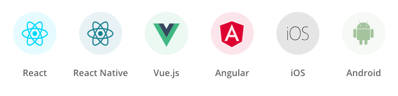
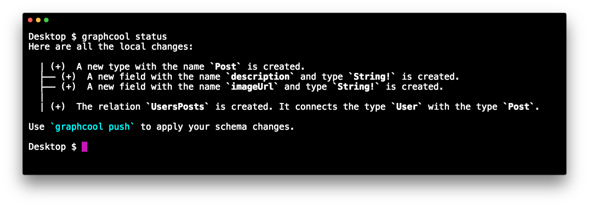

# 

Graphcool is the easiest way for web and mobile developers to get started with their own GraphQL backend. In this post, we'll give an overview of the Graphcool platform, specific features and what problems they solve.

<iframe width="560" height="315" src="https://www.youtube.com/embed/QZWAAmp406s" frameborder="0" allowfullscreen></iframe>


## Quickstart 

GraphQL is becoming the new standard for API development. Web and mobile developers are the groups that benefit most from GraphQL, however, getting started with a new technology can be scary and time-consuming.

The [Graphcool Quickstart](https://www.graph.cool/docs/quickstart) examples provide simple starter kits for all major frameworks and platforms to help you get up-and-running in less than 5 minutes.



> Check out our tutorial [video](https://youtu.be/OoPQl8hcIug) that demonstrates how to get started with GraphQL, Apollo and React.

## CLI

The [Graphcool CLI](!alias-kie1quohli) enables a great developer workflow. It can be installed with [npm](https://www.npmjs.com/package/graphcool):

```sh
npm install -g graphcool
```

Once installed, it allows to manage your Graphcool projects locally without having to use the [Graphcool Console](https://console.graph.cool).

>  Learn about all major features of the CLI in this [video](https://www.youtube.com/watch?v=sf0ZkyalSTg).

### The Project File: `project.graphcool`

The basis for managing a Graphcool project locally is the [project file](!-ow2yei7mew) called `project.graphcool` by default. The project file uses standard [GraphQL IDL](!alias-kr84dktnp0) syntax and consists of two major sections:

1. _Frontmatter_: On the top of the file, metadata about the project (such as project ID and schema version) is stored in comments. Note that this part must not be modified manually.
2. _Schema_: The schema represents the data model of the application and is the basis for the API.

Here's a quick example:

```graphql
# project: cj2m5hoko73t901758a052m5q
# version: 1

type Post implements Node {
  id: ID! @isUnique
  createdAt: DateTime!
  updatedAt: DateTime!
  description: String!
  imageUrl: String!
}

type User implements Node {
  id: ID! @isUnique
  createdAt: DateTime!
  updatedAt: DateTime!
}
```

### Creating Projects

New projects can be created with the `graphcool init` command. The following command will create new project based on a _remote schema_:

```sh
graphcool init --schema https://graphqlbin.com/instagram.graphl
```

Note that this also works for _local files_:

```sh
graphcool init --schema ./instagram.graphl
```

Sometimes it's helpful to copy (or _clone_) an existing project, this can be done using by passing the `--copy` option to `init`:

```sh
graphcool init --copy cj2m5hoko73t901758a052m5q
```

### Schema Migrations

For schema migrations, the Graphcool CLI offers the `status`, `push` and `pull` commands for you to sync your local project file with the remote schema in the Graphcool system.

`graphcool status` will indicate whether your local schema deviates from the remote one and will display the potential changes:



Use `graphcool push` to update the remote schema with the changes you made locally and `graphcool pull` to merge changes from the remote schema into your local project file.

### Other Features

The Graphcool CLI further allows you to export project data, open up a playground, view all your Graphcool projects or display a project's endpoints.


## GraphQL API

When creating a new Graphcool projects, you'll have two GraphQL APIs available:

- [`Simple API`](!alias-heshoov3ai): Offers simple and intuitive CRUD-style operations for each type in the project's schema. 
- [`Relay API`](!alias-aizoong9ah): If you want to use Facebook's homegrown GraphQL client [Relay](https://facebook.github.io/relay/), you can use the `Relay API` that adheres to Relay specific requirements.

Both APIs not only give you the full power of GraphQL by enabling you to query deeply nested information, they also offer powerful filters and out-of-the-box support for pagination and ordering making it easy to build sophisticated web and mobile apps. Check out [this article](!alias-eath7duf7d) for a few practical examples.

Graphcool also provides built-in support for [GraphQL Susbcriptions](!alias-aip7oojeiv) enabling you to easily build _realtime_ apps! Here's a [tutorial](!alias-ui0eizishe) demonstrating how to build a location-based chat using React.

[File management](!alias-eer4wiang0) and storage are also provided out-of-the-box with every Graphcool project.


## Authentication & Permissions

Privacy and data protection are of immense importance in today's applications. With Graphcool, both are trivial to achieve!

Authentication can be implemented using different [authentication providers](!alias-seimeish6e) such as [Auth0](!alias-naed3eecie) for social logins, [Digits](alias-iaxohpee8o) for phone-based authentication as well as [email-and-password based](fiayee5voh) and 
[anonymous](!alias-ieph6iujah) authentication.

> Take a tour of the Graphcool permission system with this [video](https://www.youtube.com/watch?v=l1KEssmlhPA).

Graphcool further offers an extremely powerful [permission system](!alias-oolooch8oh) to specify data access rules. Developers can declare fine-grained constrains about _which users_ should be able to perform _what operations_. These constrains are expressed using regular GraphQL queries, thus making use of a concept that is already very familiar and omitting the need for developers to learn a new system.

Check out these examples to get an idea of how the permissions system works:

<!-- PERMISSION_EXAMPLES -->


## Functions

[Serverless Functions](!alias-ahde7paig2) are a major trend in application development. With Graphcool, you can use them to extend the capabilities of your API and implement custom business logic.

A few common use cases for functions are:

- calling existing microservices
- integrating 3rd party APIs like Stripe, Mailgun, Slack,...
- sending push notifications
- data validation and transformation

There are two different kinds of functions available:

- [**Server-side Susbcriptions**](!alias-ahlohd8ohn) allow to execute a custom function _after_ a mutation was performed. This functionality is often used for sending welcome emails to new users or push notifications for specific events.
- The [**Request Pipeline**](!alias-pa6guruhaf) allows to transform and validate input arguments and the payload that the server returns to the client. You can use this functionality to validate email addresses or remove spaces from credit card numbers.

> See [Server-side Subscriptions (Video)](https://www.youtube.com/watch?v=l-0jGOxXKGY) and the [Request Pipeline (Video)](https://www.youtube.com/watch?v=GSV58k05vZI) in action.

## Integrations

Graphcool also integrates directly with 3rd party services like [Algolia](https://www.algolia.com/) or [Auth0](https://www.auth0.com) and many more to come.

Taking [Algolia Search](!alias-emaig4uiki) as an example, you can comfortably configure your search indices directly in the Graphcool Console and provide powerful search features to the users of your app!

We have great plans to make it even easier to integrate with 3rd party services in the future, stay tuned!


## Summary

Graphcool offers everything developers need! Next to a powerful GraphQL API that includes support for subscriptions, filters and pagination, developers can optimize their workflows by using the [Graphcool CLI](!alias-kie1quohli) and integrate custom business logic with [functions](!alias-boo6uteemo) and 3rd party [integrations](!alias-seimeish6e).

If you want to get your hands dirty with the features that were mentioned in this article, check out our [Freecom Fullstack Tutorial](!alias-e8a6ajt8ax) series that covers all of them using a practical example.

If you still have open questions, take a look at our [documentation](https://www.graph.cool/docs/) or join our fast growing [Slack](http://slack.graph.cool/) community!


