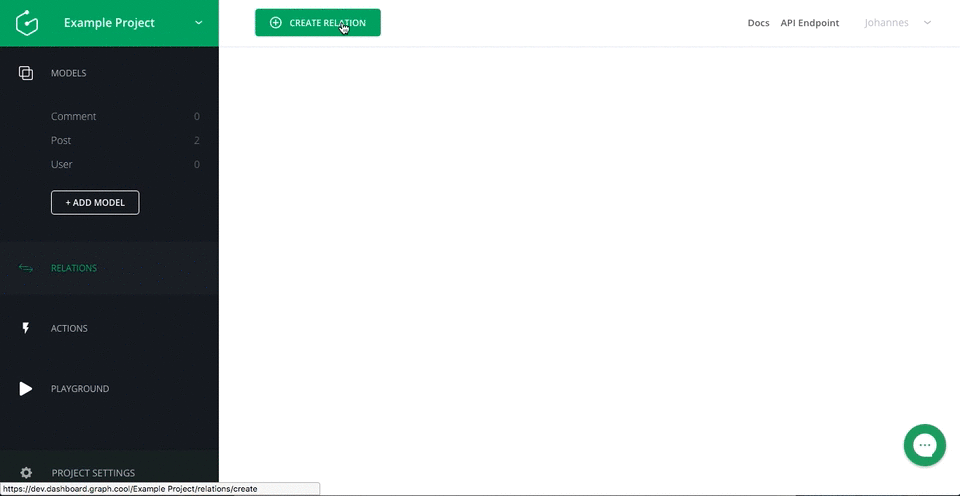

# Declaring Relations between your Models

<iframe height="315" src="https://www.youtube.com/embed/Pz51CTyqSLo" frameborder="0" allowfullscreen></iframe>

In this guide, we will expand the Instagram clone from the previous guide with a new model for comments. Models provide only so much flexibility, that's why we will also add different relations to add more dynamics to the data model of our backend.

> We assume that you already finished the [previous guide](!alias-thaeghi8ro) on how to set up a GraphQL backend in less than 5 minutes.  

We will associate a post with multiple comments as well as users to posts and comments, so we know who posted something. We will then explore the new queries and mutations that are available due to the new relations in the playground.

## 1. Creating a `Comment` model

So far we've configured the Post model. When you start building real applications you will most likely need to configure multiple models and specify relationships between them.

To learn how that works we will extend our Instagram example with a `Comment` model. For now the `Comment` model has just a single field called `text` of type `String` so let's quickly create the new model and its field like we did before.

> If you need help in creating this model, refer to the [previous guide](!alias-thaeghi8ro).

## 2. Defining a Relation between `Post` and `Comment`

Now it's time to create a "relation" between the `Post` and the `Comment` model. Before we do that let's think about what kind of relationship we want to express. We don't want comments to exist on their own. A comment only makes sense if we know what post it belongs to and it should really only belong to one post as well. On the other hand, a single post might be associated to a lot of comments. Relations like this are called `one-to-many` relations.

In order to do create a `one-to-many` relation, let's go to the relations page and click "Create Relation". Select one `Post` model on the left and many `Comment` models on the right. The name of the relation is mainly used for the name of the [generated GraphQL mutations](!alias-ol0yuoz6go). You can call it `PostComments` for example. Relation names have to start with a capital letter.



Note that this relation generates two new fields: a `comments` field on the `Post` model and `post` field on the `Comment` model.

## 3. Defining Relations between `User` and `Post` and `Comment`

Right now we can manage different posts and each post has several related comments. But what would a post be without the user that created it? Every project at Graphcool comes with a `User` model out of the box. We are interested in the `name` and the `email` of a user, so let's add those two String fields to the `User` model.

To assign a user to every post and comment that we keep track of, we create two relations between the `User` model and the `Post` and `Comment` models respectively. Let's call the relation between `User` and `Post` `PostAuthor` and choose `author` and `posts` for the field names. Make sure to select one for `User` and many for `Post`, as we again deal with a `one-to-many` relation here. Similarily, we create the `one-to-many` Relation `CommentAuthor` between `User` and `Comment` and choose `user` and `comments` as field names.

> As we've seen before we can go to the relations page and click "Create Relation" to create a relation. Check the above section if you need more information on defining relations.

## 4. Exploring the newly generated Queries and Mutations

Creating a relation results in the generation of different queries and mutations depending on the type of the relation. All the relations in our example are `one-to-many` relations, so we will only explore the ones for the `PostAuthor` relation. To do that, head over to the playground.

> If you need a general introduction to the playground, head over to the [previous guide](!alias-thaeghi8ro).

### 4.1 Query non-scalar fields

The first thing we can play with are nested fields. For example, we can now select the non-scalar field `posts` on the `allUsers` query in the playground using the Simple API

```graphql
{
  allUsers {
    id
    name
    posts {
      imageUrl
    }
  }
}
```

Vice-versa, we can select the `author` field on the `allPosts` query.

```graphql
{
  allPosts {
    id
    description
    author {
      name
    }
  }
}
```

### 4.2 Creating a post with an author

If a user creates a new post, it would be cumbersome to first create the post and then link it to this user. Instead, we can combine both steps when using the `createPost` mutation. Execute the first query from above and copy the `id` of a user that you want to create a post with. Then you can run the following mutation

```graphql
mutation b {
  createPost(imageUrl: "http://24.media.tumblr.com/tumblr_lstc7wldEY1r4xjo2o1_1280.jpg", description: "#weird #kitten", authorId: "<insert-user-id>") {
    id
  }
}
```

This will create a new post and create a new edge between the provided user and the post. An edge is the connection between two nodes.

### 4.3 Work with existing post and user nodes

If we either want to set the author of a post for the first time or for some reason we want to change the author an existing edge of the `PostAuthor` relation, we can use `addToPostAuthor`.

```graphql
mutation {
  addToPostAuthor(authorUserId: "<insert-user-id>", postsPostId: "<insert-post-id>") {
    authorUser {
      id
    }
    postsPost {
      id
    }
  }
}
```

Similarily, we can use `removeFromPostAuthor` to remove an existing edge between a post and a user node.

```graphql
mutation {
  removeFromPostAuthor(authorUserId: "<insert-user-id>", postsPostId: "<insert-post-id>") {
    authorUser {
      id
    }
    postsPost {
      id
    }
  }
}
```

> Note that we can work with the fields `authorUser` and `postsPost` to select further information on the post or the author respectively. In this example, we only selected `id` but we have access to all the fields here.

## 5. Next steps

When building real applications you will want to implement your own business logic like sending an email when a user signs up. Graphcool makes this very easy with mutation callbacks which let you run your custom code for specific mutations.

[Go ahead and learn how to implement your own business logic using Mutation Callbacks.](!alias-saigai7cha)
