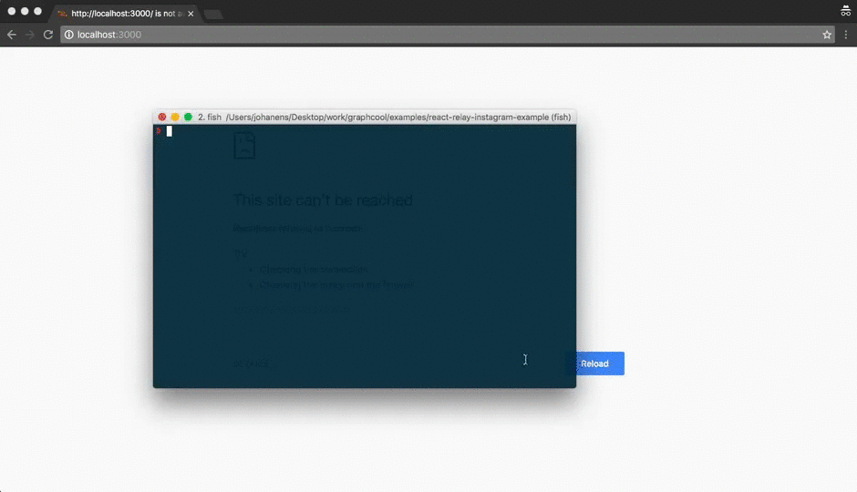

# Setting up a GraphQL backend in 5 minutes

<iframe height="315" src="https://www.youtube.com/embed/SooujCyMHe4" frameborder="0" allowfullscreen></iframe>

In this guide, you will learn how to setup the GraphQL backend for an Instagram clone in less than 5 minutes - without writing any server code. [Click here for a demo.](http://instacat.surge.sh) 📷

> You should be able to follow along even if you haven't used GraphQL before. If you're curious you can [learn more about GraphQL](https://learngraphql.com/) or read [why it's better than REST APIs](https://medium.com/apollo-stack/why-graphql-is-the-future-3bec28193807).

At the end of this guide you will have a good understanding of how to configure a GraphQL server and query it from your application.

We'll start by defining the basic data model and adding a few data nodes. This will be enough to get our GraphQL server ready. After exploring the API of our Instagram backend we will download and run an example app that is connected to this API.

> This guide covers the same topics as the getting started tour. We assume you've already created a Graphcool account, otherwise please **[sign up here](https://console.graph.cool/signup)**. If you've already completed this guide you can safely skip [to the next guide](!alias-daisheeb9x) introducing Relations.

## 1. Creating a `Post` model

The foundation of every backend application is its data model. Graphcool lets you define your data model using "models" which represent a certain type of your data. In our example we want to create a `Post` model which stores information such as the image URL and the description for each post.

In order to do that, please open your [console](https://console.graph.cool) and add a new model called `Post`.


## 2. Defining fields for the `Post` model

Once we've created the `Post` model we can create "fields" for the image URL and the description. Both of them contain scalar values of type `String`. Go ahead and create two new fields named `description` and `imageUrl`.


You can do a lot more with fields such as defining [permissions](!alias-iegoo0heez) or [constraints](!alias-teizeit5se#unique) but we'll stick to the basics for now.

To instill life into our backend, let's open the data browser and add some data.

## 3. Creating example data

Every data item is called a "node" as we are using [graph terminology](!alias-ahsoow1ool) throughout the Graphcool platform. You can either work with your data through one of the GraphQL APIs or by using the data browser in the console. Let's use the data browser for now.

Go ahead and create a few example data nodes in your project. In the data browser click on "Add Node" and fill out the field values. We have prepared some cute kittens for you, but feel free to add whatever data nodes you like.

```
[{
	"description": "#cute #kitten",
	"imageUrl": "http://i.imgur.com/5ACuqm4.jpg"
}, {
	"description": "#funny #kitten",
	"imageUrl": "http://i.imgur.com/1aEgam8.jpg"
}]
```


## 4. Exploring the playground - the GraphQL workflow

GraphQL makes it incredibly intuitive and fun to play around with your API. The easiest way to do that is using the "Playground". It includes an [interactive GraphQL editor](https://github.com/graphql/graphiql) with features like auto completion and a query history.

When building an app with GraphQL a proven workflow is to experiment with different queries in the playground and then "copy & paste" selected queries into the code of your frontend application. Let's write our first query to fetch all posts including their image url and description.


Note how auto completion helps us to explore the API. You can always trigger it manually by pressing `Ctrl + Space`.

Let's try a more complex query now: we want to only fetch posts that contain the `#coolgraph` hashtag. Our API includes a powerful filter system for queries that makes this task quite easy!


The Playground also contains a "Docs" section that you can expand by clicking on the Docs link in the top right corner. The docs are automatically updated whenever you change your data model and are a great way to explore the GraphQL API for your project.

## 5. Connecting an application

That's it! Now that we've configured our data model and added a few data nodes our backend is ready to be tested. We already prepared an example web app for you. Please choose one of the following technologies in order to download the example:

<!-- __INJECT_GRAPHCOOL_SIGNUP__ -->

Unzip the file and open the source code in your favorite editor. Copy your API endpoint from the console sidebar and inject it into your app following the instructions in the example's README. (Use the "Relay" API endpoint when you're using Relay, otherwise use the "Simple" endpoint.)

Next please open the directory in a terminal. Run `npm install` and `npm start` in order get the example app up and running on `http://localhost:3000`. You should be able to see the app with the data you created earlier.



This guide doesn't cover how to implement the frontend but the provided source code is fairly small and very readable, so feel free to explore it on your own. The example app you just downloaded should also be a good starting point for your own app. All examples are also [available on Github](https://github.com/graphcool-examples).

## 6. Next steps

Good job! You've now learned how to setup a powerful GraphQL backend for your next project and how to manage its data and connect it to your frontend application. And keep in mind - what you've seen so far are just the basics of what's possible with the Graphcool platform.
And because Graphcool manages the backend and database for you, you don't have to worry about data migrations when changing your data model. Any required transformations will be automatically applied.

Please feel free to check out [other guides](/docs/tutorials) or the [reference documentation](/docs/reference) to learn about concepts like authentication, permissions or file handling.

Go ahead and learn how to [add relations between models](!alias-daisheeb9x) to further enrich your data model.
